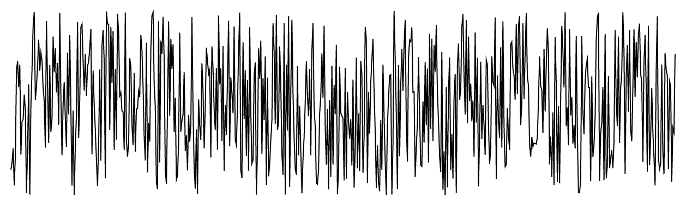
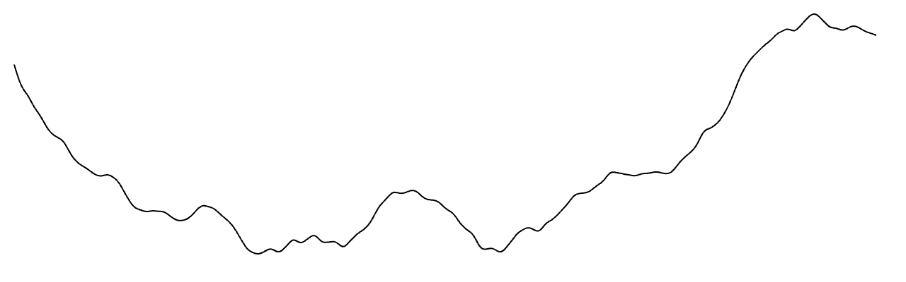
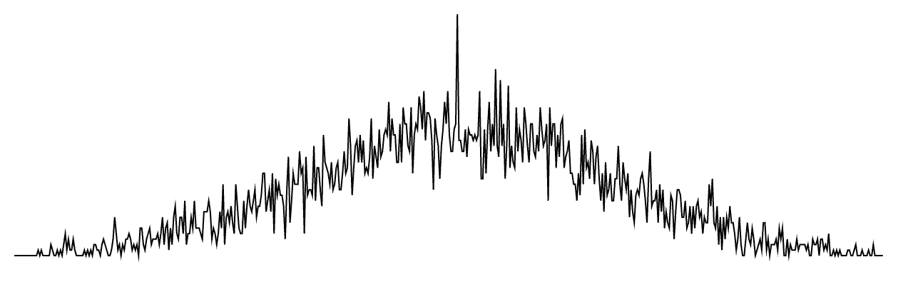
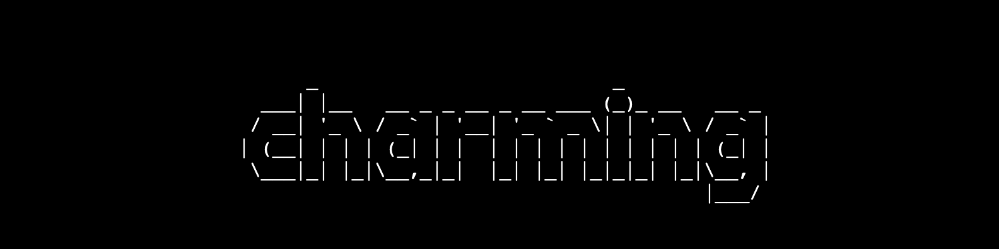
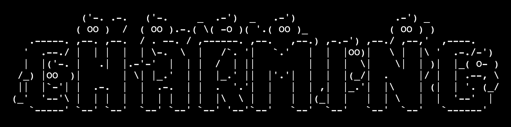
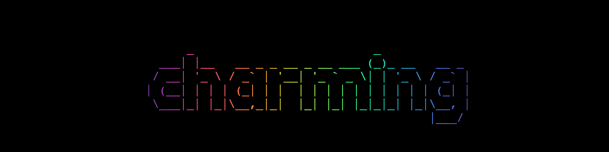
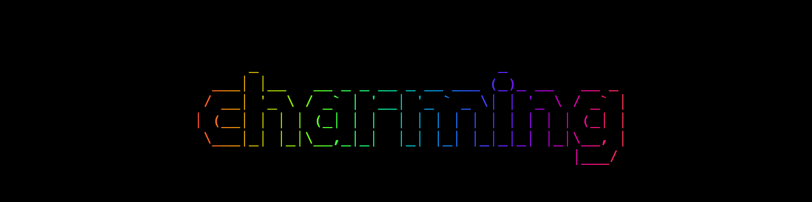

# Charming: Charm Computing

The data-driven language for creative coding and ASCII art.

## Installing

Charming is typically installed via a package manager such as Yarn or NPM.

```bash
yarn add @charming-art/charming
```

```bash
npm install @charming-art/charming
```

Charming can then imported as a namespace:

```js
import * as cm from "@charming-art/charming";
```

In vanilla HTML, Charming can be imported as an ES module, say from jsDelivr:

```html
<script type="module">
  import * as cm from "https://cdn.jsdelivr.net/npm/@charming-art/charming@0.1/+esm";

  const app = cm.app();

  // ...

  document.body.append(app.render());
</script>
```

Charming is also available as a UMD bundle for legacy browsers.

```html
<script src="https://cdn.jsdelivr.net/npm/@charming-art/charming@0.1"></script>
<script>
  const app = cm.app();

  // ...

  document.body.append(app.render());
</script>
```

## Quick Examples

```js
import * as cm from "@charming-art/charming";

const app = cm.app({
  width: 640,
  height: 640,
});

app
  .data(cm.range(240))
  .process(cm.map, (_, i, data) => (i * Math.PI * 2) / data.length)
  .append(cm.circle, {
    x: (t) => Math.cos(t) * Math.cos(t * 3),
    y: (t) => Math.sin(t) * Math.cos(t * 3),
    r: (_, i) => i,
  })
  .transform(cm.mapAttrs, {
    x: { range: [15, app.prop("width") - 30] },
    y: { range: [15, app.prop("height") - 30] },
    r: { range: [1, 15] },
  });

document.body.appendChild(app.render());
```

## API Reference

- [App](#app)
- [Flow](#flow)
- [Renderer](#renderer)
- [Shape](#shape)
- [Transform](#transform)
- [Scale](#scale)
- [Event](#event)
- [Prop](#prop)
- [Color](#color)
- [Array](#array)
- [Math](#math)
- [Constant](#constant)
- [Font](#font)
- [Gradient](#gradient)
- [Helper](#helper)
- [Vector](#vector)

### App

<a name="cm-app" href="#cm-app">#</a> cm.**app**(_[options]_)

<a name="app-data" href="#app-data">#</a> app.**data**(_value_)

<a name="app-datum" href="#app-datum">#</a> app.**datum**(_value_)

<a name="app-append" href="#app-append">#</a> app.**append**(_shape[, options]_)

<a name="app-render" href="#app-render">#</a> app.**render**()

<a name="app-start" href="#app-start">#</a> app.**start**()

<a name="app-stop" href="#app-stop">#</a> app.**stop**()

<a name="app-dispose" href="#app-dispose">#</a> app.**dispose**()

<a name="app-node" href="#app-node">#</a> app.**node**()

<a name="app-prop" href="#app-prop">#</a> app.**prop**(_name_)

<a name="app-on" href="#app-on">#</a> app.**on**(_name, callback_)

<a name="app-call" href="#app-call">#</a> app.**call**(_callback[, arguments…]_)

<a name="app-textBBox" href="#app-textBBox">#</a> app.**textBBox**(_options_)

### Flow

<a name="flow-append" href="#flow-append">#</a> flow.**append**(_shape[, options]_)

<a name="flow-data" href="#flow-data">#</a> flow.**data**(_value_)

<a name="flow-datum" href="#flow-datum">#</a> flow.**datum**(_value_)

<a name="flow-process" href="#flow-process">#</a> flow.**process**(_process, options_)

<a name="flow-transform" href="#flow-transform">#</a> flow.**transform**(_transform, options_)

<a name="flow-call" href="#flow-call">#</a> flow.**call**(_callback[, arguments…]_)

<a name="flow-app" href="#flow-app">#</a> flow.**app**()

### Renderer

<a name="cm-canvas" href="#cm-canvas">#</a> cm.**canvas()**

<a name="cm-terminal" href="#cm-terminal">#</a> cm.**terminal()**

### Process

<a name="cm-each" href="#cm-each">#</a> cm.**each**

<a name="cm-eachRight" href="#cm-eachRight">#</a> cm.**eachRight**

<a name="cm-filter" href="#cm-filter">#</a> cm.**filter**

<a name="cm-map" href="#cm-map">#</a> cm.**map**

<a name="cm-push" href="#cm-push">#</a> cm.**push**

### Shape

<a name="cm-point" href="#cm-point">#</a> cm.**point**

<a name="cm-link" href="#cm-link">#</a> cm.**link**

<a name="cm-rect" href="#cm-rect">#</a> cm.**rect**

<a name="cm-circle" href="#cm-circle">#</a> cm.**circle**

<a name="cm-triangle" href="#cm-triangle">#</a> cm.**triangle**

<a name="cm-polygon" href="#cm-polygon">#</a> cm.**polygon**

<a name="cm-line" href="#cm-line">#</a> cm.**line**

<a name="cm-path" href="#cm-path">#</a> cm.**path**

<a name="cm-text" href="#cm-text">#</a> cm.**text**

<a name="cm-group" href="#cm-group">#</a> cm.**group**

<a name="cm-clear" href="#cm-clear">#</a> cm.**clear**

### Transform

<a name="cm-mapAttrs" href="#cm-mapAttrs">#</a> cm.**mapAttrs**

<a name="cm-mapPosition" href="#cm-mapPosition">#</a> cm.**mapPosition**

### Scale

<a name="cm-scaleLinear" href="#cm-scaleLinear">#</a> cm.**scaleLinear**(_domain, range_)

<a name="cm-scaleSqrt" href="#cm-scaleSqrt">#</a> cm.**scaleSqrt**(_domain, range_)

<a name="cm-scaleLog" href="#cm-scaleLog">#</a> cm.**scaleLog**(_domain, range_)

### Event

<a name="event-update" href="#event-update">#</a> event.**update**

<a name="event-mouseDown" href="#event-mouseDown">#</a> event.**mouseDown**

<a name="event-mouseUp" href="#event-mouseUp">#</a> event.**mouseUp**

<a name="event-mouseClick" href="#event-mouseClick">#</a> event.**mouseClick**

<a name="event-beforeEach" href="#event-beforeEach">#</a> event.**beforeEach**

<a name="event-afterEach" href="#event-afterEach">#</a> event.**afterEach**

<a name="event-beforeAll" href="#event-beforeAll">#</a> event.**beforeAll**

<a name="event-afterAll" href="#event-afterAll">#</a> event.**afterAll**

### Prop

<a name="prop-width" href="#prop-width">#</a> prop.**width**

<a name="prop-height" href="#prop-height">#</a> prop.**height**

<a name="prop-pixelWidth" href="#prop-pixelWidth">#</a> prop.**pixelWidth**

<a name="prop-pixelHeight" href="#prop-pixelHeight">#</a> prop.**pixelHeight**

<a name="prop-frameCount" href="#prop-frameCount">#</a> prop.**frameCount**

<a name="prop-frameRate" href="#prop-frameRate">#</a> prop.**frameRate**

<a name="prop-mouseX" href="#prop-mouseX">#</a> prop.**mouseX**

<a name="prop-mouseY" href="#prop-mouseY">#</a> prop.**mouseY**

<a name="prop-mode" href="#prop-mode">#</a> prop.**mode**

<a name="prop-cellWidth" href="#prop-cellWidth">#</a> prop.**cellWidth**

<a name="prop-cellHeight" href="#prop-cellHeight">#</a> prop.**cellHeight**

<a name="prop-fontSize" href="#prop-fontSize">#</a> prop.**fontSize**

<a name="prop-fontFamily" href="#prop-fontFamily">#</a> prop.**fontFamily**

<a name="prop-fontWeight" href="#prop-fontWeight">#</a> prop.**fontWeight**

### Color

<a name="cm-rgb" href="#cm-rgb">#</a> cm.**rgb**(_r[, g[, b]]_)

<a name="cm-cfb" href="#cm-cfb">#</a> cm.**cfb**(_ch[, f[, b]]_)

<a name="cm-wch" href="#cm-wch">#</a> cm.**wch**(_ch_)

### Array

<a name="cm-range" href="#cm-range">#</a> cm.**range**(_count[, start[, end]]_)

<a name="cm-cross" href="#cm-cross">#</a> cm.**cross**(_array…_)

<a name="cm-extent" href="#cm-extent">#</a> cm.**extent**(_array[, valueof]_)

### Math

<a name="cm-clamp" href="#cm-clamp">#</a> cm.**clamp**(_value, min, max_)

Constrains the input _value_ within the specified range _[min, max]_.

```js
const x = 10;
cm.clamp(10, 2, 8); // 8
cm.clamp(10, 2, 12); // 10
cm.clamp(10, 12, 20); // 12
```

<a name="cm-random" href="#cm-random">#</a> cm.**random**(_[min[, max]]_)

Generates random number with a uniform distribution, which is within range _\[min, max\)_. If _min_ is not specified, it defaults to 0; if _max_ is not specified, it defaults to 1.

```js
cm.random(); // 0.4418278691734798
cm.random(10); // 3.747820060823679
cm.random(2, 10); // 6.649642684087617
```



<a name="cm-randomNoise" href="#cm-randomNoise">#</a> cm.**randomNoise**(_[octaves[, seed]]_)

Returns a function for generating random numbers with a smooth, continuous random-like distribution, commonly referred to as [Perlin Noise](https://en.wikipedia.org/wiki/Perlin_noise).

The layers of noise is _octaves_ and increasing the number of octaves results in a more variable sequence. If _octaves_ is not specified, it defaults to 0.

A _seed_ can be specified as a real number or as any integer. Two generators instanced with the same seed and octaves generate the same sequence. If _seed_ is not specified, it defaults to 0.

The returned function accept two parameters: _x_ is x coordinate in noise space; _y_ is y coordinate in noise space.

```js
cm.randomNoise()(0.2, 0.1); // 0.04076453205333332
cm.randomNoise(6, 2)(0.2, 0.1); // -0.08489767172063487
```



<a name="cm-randomNormal" href="#cm-randomNormal">#</a> cm.**randomNormal**(_[mu[, sigma]]_)

Returns a function for generating random numbers with a [normal(Gaussian) distribution](https://en.wikipedia.org/wiki/Normal_distribution). The expected value of the generated number is _mu_, with given standard deviation sigma. If _mu_ is not specified, it defaults to 0; if _sigma_ is not specified, it defaults to 1.

```js
cm.randomNormal()(); // -2.0897431210663022
cm.randomNormal(30, 10)(); // 31.94829616303788
```



### Constant

<a name="cm-two-pi" href="#cm-two-pi">#</a> cm.**TWO_PI**

It is twice the ratio of the circumference of a circle to its diameter.

```js
Math.cos(cm.TOW_PI); // 1
```

### Font

<a name="cm-fontStandard" href="#cm-fontStandard">#</a> cm.**fontStandard**()

Parses and returns the standard font for the fontFamily attribute.

```js
app.append(cm.text, {
  // ...
  fontFamily: cm.fontStandard(),
});
```



<a name="cm-fontGhost" href="#cm-fontGhost">#</a> cm.**fontGhost**()

Parses and returns the ghost font for the fontFamily attribute.

```js
app.append(cm.text, {
  // ...
  fontFamily: cm.fontGhost(),
});
```



### Gradient

<a name="cm-gradientRainBowX" href="#cm-gradientRainBowX">#</a> cm.**gradientRainBowX**()

Returns the fill attribute with the vertical rainbow gradient.

```js
app.append(cm.text, {
  // ...
  fill: cm.gradientRainBowX(),
});
```



<a name="cm-gradientSineBowX" href="#cm-gradientSineBowX">#</a> cm.**gradientSineBowX**()

Returns the fill attribute with the vertical sinebox gradient.

```js
app.append(cm.text, {
  // ...
  fill: cm.gradientRainBowX(),
});
```



### Helper

<a name="cm-pathArray" href="#cm-pathArray">#</a> cm.**pathArray**()

Constructs a new path generator like [d3-path](https://d3js.org/d3-path#path) serializer, expect returns an array of path commands instead of a path string. Useful for charming to render the path generated by [d3-shape](https://d3js.org/d3-shape) or [d3-geo](https://d3js.org/d3-geo/path) without parsing it, which is good for performance.

```js
const circle = d3.geoCircle()();
const projection = d3.geoOrthographic().translate([0, 0]).scale(10);
const path = d3.geoPath(projection);

app.append(cm.path, {
  d: () => {
    const context = cm.pathArray();
    path.context(context)(circle);
    return context.toArray();
  },
});
```

See [d3-path](https://d3js.org/d3-path#path) for more [CanvasPathMethods](https://html.spec.whatwg.org/multipage/#canvaspathmethods).

<a name="pathArray-toArray" href="#pathArray-toArray">#</a> pathArray.**toArray**()

Returns the array of path commands.

```js
const context = cm.pathArray();
context.moveTo(0, 0);
context.lineTo(10, 0);
context.lineTo(10, 10);
context.closePath();
context.toArray(); // [["M", 0, 0], ["L", 10, 0], ["L", 10, 10], ["Z"]]
```

### Vector

<a name="cm-vec" href="#cm-vec">#</a> cm.**vec**(_[x[, y]]_)

Constructs a vector with the specified _x_ and _y_ component. If either _x_ or _y_ are not specified, each defaults to 0. The returned vector has the following properties:

- x - x component of the vector
- y - y component of the vector

```js
cm.vec(); // { x: 0, y: 0 }
cm.vec(1); // { x: 1, y: 0 }
cm.vec(2, 3); // { x: 2, y: 3 }
```

<a name="cm-vecFromAngle" href="#cm-vecFromAngle">#</a> cm.**vecFromAngle**(_angle_)

Constructs a vector from the specified _angle_ in radians.

```js
cm.vecFromAngle(Math.PI / 4); // { x: 1, y: 1 }
```

<a name="cm-vecAdd" href="#cm-vecAdd">#</a> cm.**vecAdd**(_a, b_)

Adds the specified _vectors_ and returns a new vector.

```js
const a = cm.vec(1, 2);
const b = cm.vec(2, 3);
const c = cm.vecAdd(a, b);
a; // { x: 1, y: 2 }
b; // { x: 2, y: 3 }
c; // { x: 3, y: 5 }
```

<a name="cm-vecAngle" href="#cm-vecAngle">#</a> cm.**vecAngle**(_a_)

Computes the angle of the specified _vector_.

```js
const a = cm.vec(1, 1);
cm.vecAngle(a); // Math.PI / 4
```

<a name="cm-vecClamp" href="#cm-vecClamp">#</a> cm.**vecClamp**(_a, min[, max]_)

Constrains the magnitude of the specified _vector_ within the specified range _[min, max]_, and returns a new _vector_.

```js
const a = cm.vec(3, 4);
const b = cm.vecClamp(a, 10, 15);
a; // { x: 3, y: 4 }
b; // { x: 6, y: 8 }
```

If two arguments are specified, the second one is interpreted as the _maximum magnitude_, with the minium magnitude defaults to 0.

```js
const a = cm.vec(6, 8);
cm.vecClamp(a, 5); // { a: 3, b: 4 }
```

<a name="cm-vecClampX" href="#cm-vecClampX">#</a> cm.**vecClampX**(_a, min[, max]_)

Constrains the x component of the specified _vector_ within the specified range _[min, max]_, and returns a new _vector_.

```js
const a = cm.vec(6, 8);
const b = cm.vecClampX(a, 10, 15);
a; // { x: 6, y: 8 }
b; // { x: 10, y: 8 }
```

If two arguments are specified, the second one is interpreted as the _maximum value_, with the minium value defaults to 0.

```js
const a = cm.vec(6, 8);
const b = cm.vecClampX(a, 5);
a; // { x: 6, y: 8 }
b; // { x: 5, y: 8 }
```

<a name="cm-vecClampY" href="#cm-vecClampY">#</a> cm.**vecClampY**(_a, min[, max]_)

Constrains the y component of the specified _vector_ within the specified range _[min, max]_, and returns a new _vector_.

```js
const a = cm.vec(6, 8);
const b = cm.vecClampY(a, 10, 15);
a; // { x: 6, y: 8 }
b; // { x: 6, y: 10 }
```

If two arguments are specified, the second one is interpreted as the _maximum value_, with the minium value defaults to 0.

```js
const a = cm.vec(6, 8);
const b = cm.vecClampY(a, 5);
a; // { x: 6, y: 8 }
b; // { x: 6, y: 5 }
```

<a name="cm-vecCross" href="#cm-vecCross">#</a> cm.**vecCross**(_a, b_)

Computes the cross product of the specified _vectors_.

```js
const a = cm.vec(3, 4);
const b = cm.vec(1, 2);
cm.vecCross(a, b); // 2
```

<a name="cm-vecDist" href="#cm-vecDist">#</a> cm.**vecDist**(_a, b_)

Computes the distance of the specified _vectors_.

```js
const a = cm.vec(4, 6);
const b = cm.vec(1, 2);
cm.vecDist(a, b); // 5
```

<a name="cm-vecDist2" href="#cm-vecDist2">#</a> cm.**vecDist2**(_a, b_)

Computes the square distance of the specified _vectors_.

```js
const a = cm.vec(4, 6);
const b = cm.vec(1, 2);
cm.vecDist2(a, b); // 25
```

<a name="cm-vecDiv" href="#cm-vecDiv">#</a> cm.**vecDiv**(_a, value_)

Divides the specified _vector's_ x and y component by the specified _value_, and returns a new _vector_.

```js
const a = cm.vec(3, 4);
const b = cm.vecDiv(a, 0.5);
a; // { x: 3, y: 4 }
b; // { x: 6, y: 8 }
```

<a name="cm-vecDot" href="#cm-vecDot">#</a> cm.**vecDot**(_a, b_)

Computes the dot product of the specified _vectors_.

```js
const a = cm.vec(3, 4);
const b = cm.vec(1, 2);
cm.vecDot(a, b); // 11
```

<a name="cm-vecInX" href="#cm-vecInX">#</a> cm.**vecInX**(_a, min[, max]_)

Returns true if the specified _vector's_ x component is within the specified range _[min, max]_.

```js
const a = cm.vec(3, 4);
cm.vecInX(a, 1, 2); // false
cm.vecInX(a, 1, 3); // true
cm.vecInX(a, 1, 4); // true
```

If two arguments are specified, the second one is interpreted as the _maximum value_, with the minium value defaults to 0.

```js
const a = cm.vec(3, 4);
cm.vecInX(a, 2); // false
cm.vecInX(a, 3); // true
cm.vecInX(a, 4); // true
```

<a name="cm-vecInY" href="#cm-vecInY">#</a> cm.**vecInY**(_a, x[, x1]_)

Returns true if the specified _vector's_ y component is within the specified range _[min, max]_.

```js
const a = cm.vec(3, 4);
cm.vecInY(a, 1, 3); // false
cm.vecInY(a, 1, 4); // true
cm.vecInY(a, 1, 5); // true
```

If two arguments are specified, the second one is interpreted as the maximum value, with the minium value defaults to 0.

```js
const a = cm.vec(3, 4);
cm.vecInY(a, 3); // false
cm.vecInY(a, 4); // true
cm.vecInY(a, 5); // true
```

<a name="cm-vecMag" href="#cm-vecMag">#</a> cm.**vecMag**(_a[, value]_)

If only one argument is specified, computes the magnitude of the specified _vector_.

```js
const a = cm.vec(3, 4);
cm.vecMag(a); // 5
```

If two arguments are specified, sets the magnitude of the specified _vector_ to the specified _value_, and returns a new vector.

```js
const a = cm.vec(3, 4);
const b = cm.vecMag(a, 10);
a; // { x: 3, y: 4 }
b; // { x: 6, y: 8 }
```

<a name="cm-vecMult" href="#cm-vecMult">#</a> cm.**vecMult**(_a, value_)

Multiplies the specified _vector's_ x and y component by the specified _value_, and returns a new vector.

```js
const a = cm.vec(3, 4);
const b = cm.vecMult(a, 2);
a; // { x: 3, y: 4 }
b; // { x: 6, y: 8 }
```

<a name="cm-vecNeg" href="#cm-vecNeg">#</a> cm.**vecNeg**(_a_)

Negates the specified _vector's_ x and y component, and returns a new vector.

```js
const a = cm.vec(3, 4);
const b = cm.vecNeg(a);
a; // { x: 3, y: 4 }
b; // { x: -3, y: -4 }
```

<a name="cm-vecNegX" href="#cm-vecNegX">#</a> cm.**vecNegX**(_a_)

Negates the specified _vector's_ x component, and returns a new vector.

```js
const a = cm.vec(3, 4);
const b = cm.vecNegX(a);
a; // { x: 3, y: 4 }
b; // { x: -3, y: 4 }
```

<a name="cm-vecNegY" href="#cm-vecNegY">#</a> cm.**vecNegY**(_a_)

Negates the specified _vector's_ y component, and returns a new vector.

```js
const a = cm.vec(3, 4);
const b = cm.vecNegY(a);
a; // { x: 3, y: 4 }
b; // { x: 3, y: -4 }
```

<a name="cm-vecNorm" href="#cm-vecNorm">#</a> cm.**vecNorm**(_a_)

Normalizes the specified _vector_, and returns a new vector.

```js
const a = cm.vec(3, 4);
const b = cm.vecNorm(a);
a; // { x: 3, y: 4 }
b; // { x: 0.6, y: 0.8 }
```

<a name="cm-vecRandom" href="#cm-vecRandom">#</a> cm.**vecRandom**()

Returns a unit vector with a random heading, following a uniform distribution.

```js
cm.vecRandom(); // { x: 0.9239434883837478, y: 0.688605153583981 }
```

<a name="cm-vecSub" href="#cm-vecSub">#</a> cm.**vecSub**(_a, b_)

Subtracts the specified _vectors_ and returns a new vector.

```js
const a = cm.vec(1, 2);
const b = cm.vec(2, 4);
const c = cm.vecSub(a, b);
a; // { x: 1, y: 2 }
b; // { x: 2, y: 4 }
c; // { x: -1, y: -2 }
```

<a name="vec-clone" href="#vec-clone">#</a> vec.**clone**()

Clones the _vector_ and returns a new vector.

```js
const a = cm.vec(1, 2);
const b = a.clone();
a === b; // false
b; // { x: 1, y: 2 }
```

<a name="vec-add" href="#vec-add">#</a> vec.**add**(_a_)

Adds the specified _vector_ to the target vector, and returns the target vector.

```js
const a = cm.vec(1, 2);
const b = cm.vec(3, 4);
a.add(b); // a
a; // { x: 4, y: 6 }
```

<a name="vec-angle" href="#vec-angle">#</a> vec.**angle**()

Computes the angle of the target vector.

```js
const a = cm.vec(1, 1);
a.angle(); // Math.PI / 4
```

<a name="vec-clamp" href="#vec-clamp">#</a> vec.**clamp**(_min[, max]_)

Constrains the magnitude of the target vector within the specified range _[min, max]_, and returns it.

```js
const a = cm.vec(3, 4);
a.clamp(10, 15); // a
a; // { x: 6, y: 8 }
```

If two arguments are specified, the second one is interpreted as the _maximum magnitude_, with the minium magnitude defaults to 0.

```js
const a = cm.vec(6, 8);
a.clamp(5); // a
a; // { a: 3, b: 4 }
```

<a name="vec-clampX" href="#vec-clampX">#</a> vec.**clampX**(_min[, max]_)

Constrains the x component of the target _vector_ within the specified range _[min, max]_, and returns it.

```js
const a = cm.vec(6, 8);
a.clampX(10, 15); // a
a; // { x: 10, y: 8 }
```

If two arguments are specified, the second one is interpreted as the _maximum value_, with the minium value defaults to 0.

```js
const a = cm.vec(6, 8);
a.clampX(5); // a
a; // { x: 5, y: 8 }
```

<a name="vec-clampY" href="#vec-clampY">#</a> vec.**clampY**(_min[, max]_)

Constrains the y component of the target _vector_ within the specified range _[min, max]_, and returns it.

```js
const a = cm.vec(6, 8);
a.clampY(10, 15); // a
a; // { x: 6, y: 10 }
```

If two arguments are specified, the second one is interpreted as the _maximum value_, with the minium value defaults to 0.

```js
const a = cm.vec(6, 8);
a.clampY(5);
a; // { x: 6, y: 5 }
```

<a name="vec-cross" href="#vec-cross">#</a> vec.**cross**(_a_)

Computes the cross product of the specified _vector_ and the target vector.

```js
const a = cm.vec(3, 4);
const b = cm.vec(1, 2);
a.cross(b); // 2
```

<a name="vec-dist" href="#vec-dist">#</a> vec.**dist**(_a_)

Computes the distance of the specified _vector_ and the target vector.

```js
const a = cm.vec(4, 6);
const b = cm.vec(1, 2);
a.dist(b); // 5
```

<a name="vec-dist2" href="#vec-dist2">#</a> vec.**dist2**(_a_)

Computes the square distance of the specified _vector_ and the target vector.

```js
const a = cm.vec(4, 6);
const b = cm.vec(1, 2);
a.dist(b); // 25
```

<a name="vec-div" href="#vec-div">#</a> vec.**div**(_value_)

Divides the target vector' x and y component by the specified _value_, and returns it.

```js
const a = cm.vec(3, 4);
a.div(0.5); // a
a; // { x: 6, y: 8 }
```

<a name="vec-dot" href="#vec-dot">#</a> vec.**dot**(_a_)

Computes the dot product of the specified _vector_ and the target vector.

```js
const a = cm.vec(3, 4);
const b = cm.vec(1, 2);
a.dot(b); // 11
```

<a name="vec-inX" href="#vec-inX">#</a> vec.**inX**(_min[, max]_)

Returns true if the target vector's x component is within the specified range _[min, max]_.

```js
const a = cm.vec(3, 4);
a.inX(1, 2); // false
a.inX(1, 3); // true
a.inX(1, 4); // true
```

If two arguments are specified, the second one is interpreted as the _maximum value_, with the minium value defaults to 0.

```js
const a = cm.vec(3, 4);
a.inX(2); // false
a.inX(3); // true
a.inX(4); // true
```

<a name="vec-inY" href="#vec-inY">#</a> vec.**inY**(_min[, max]_)

Returns true if the target vector's y component is within the specified range _[min, max]_.

```js
const a = cm.vec(3, 4);
a.inY(1, 3); // false
a.inY(1, 4); // true
a.inY(1, 5); // true
```

If two arguments are specified, the second one is interpreted as the maximum value, with the minium value defaults to 0.

```js
const a = cm.vec(3, 4);
a.inY(3); // false
a.inY(4); // true
a.inY(5); // true
```

<a name="vec-mag" href="#vec-mag">#</a> vec.**mag**(_[value]_)

If no argument is specified, computes the magnitude of the target vector.

```js
const a = cm.vec(3, 4);
cm.mag(); // 5
```

If one argument is specified, sets the magnitude of the target to the specified _value_, and returns it.

```js
const a = cm.vec(3, 4);
a.mag(10); // a
a; // { x: 6, y: 8 }
```

<a name="vec-mult" href="#vec-mult">#</a> vec.**mult**(_m_)

Multiplies the specified component's x and y by the specified _value_, and returns a new vector.

```js
const a = cm.vec(3, 4);
const b = cm.vecMult(a, 2);
a; // { x: 3, y: 4 }
b; // { x: 6, y: 8 }
```

<a name="vec-neg" href="#vec-neg">#</a> vec.**neg**()

Negates the target vector's x and y component, and returns it.

```js
const a = cm.vec(3, 4);
a.neg(); // a
a; // { x: -3, y: -4 }
```

<a name="vec-negX" href="#vec-negX">#</a> vec.**negX**()

Negates the target vector's x component, and returns it.

```js
const a = cm.vec(3, 4);
a.negX(); // a
a; // { x: -3, y: 4 }
```

<a name="vec-negY" href="#vec-negY">#</a> vec.**negY**()

Negates the target vector's y component, and returns it.

```js
const a = cm.vec(3, 4);
a.negY(); // a
a; // { x: 3, y: -4 }
```

<a name="vec-norm" href="#vec-norm">#</a> vec.**norm**()

Normalizes the target vector, and returns it.

```js
const a = cm.vec(3, 4);
a.norm(); // a
a; // { x: 0.6, y: 0.8 }
```

<a name="vec-set" href="#vec-set">#</a> vec.**set**(_x[, y]_)

If only one argument is specified and it is a vector instance, sets the target vector's x and y component with the source _vector's_ x and y component, and returns the target vector.

```js
const a = cm.vec(1, 2);
const b = cm.vec(3, 4);
a.set(b); // a
a; // { x: 3, y: 4 }
```

If two arguments are specified, sets the target vector's x and y component with the specified _x_ and _y_, and returns it.

```js
const a = cm.vec(1, 2);
a.set(3, 4); // a
a; // { x: 3, y: 4 }
```

<a name="vec-setX" href="#vec-setX">#</a> vec.**setX**(_x_)

Sets the target vector's x component with the specified _x_, and returns it.

```js
const a = cm.vec(1, 2);
a.setX(3); // a
a; // { x: 3, y: 2 }
```

<a name="vec-setY" href="#vec-setY">#</a> vec.**setY**(_y_)

Sets the target vector's y component with the specified _y_, and returns it.

```js
const a = cm.vec(1, 2);
a.setY(3); // a
a; // { x: 1, y: 3 }
```

<a name="vec-sub" href="#vec-sub">#</a> vec.**sub**(_a_)

Subtracts the target vector with the specified vector and returns the target vector.

```js
const a = cm.vec(1, 2);
const b = cm.vec(2, 4);
a.sub(b); // a
a; // { x: -1, y: -2 }
b; // { x: 2, y: 4 }
```
