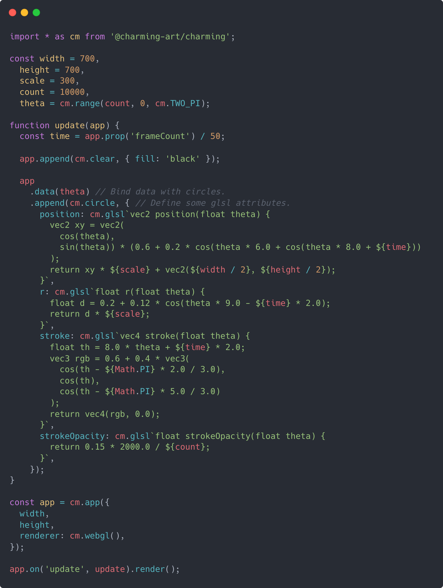
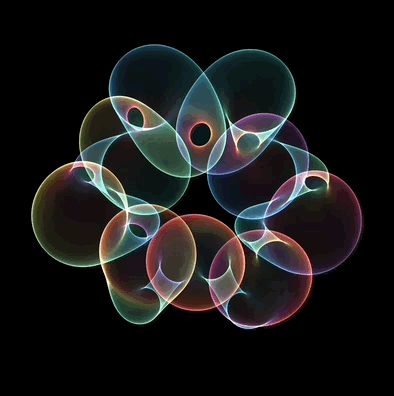
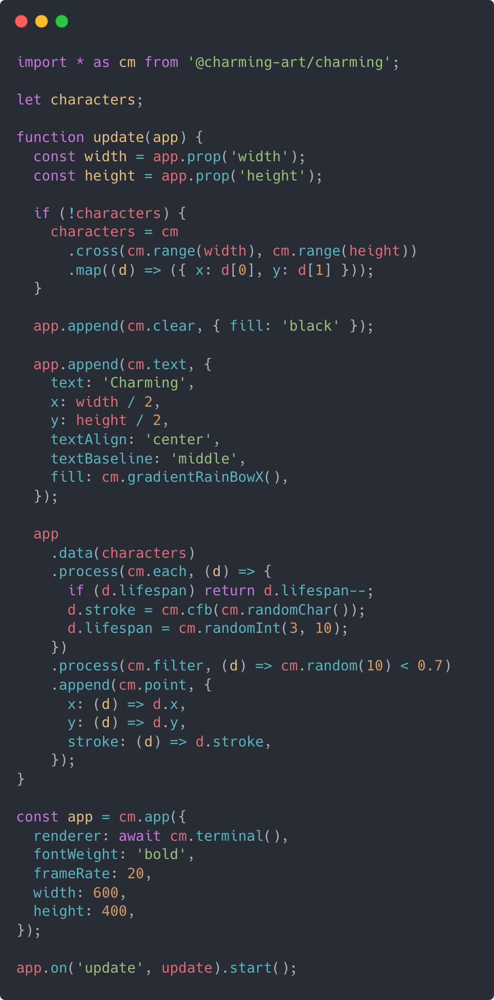
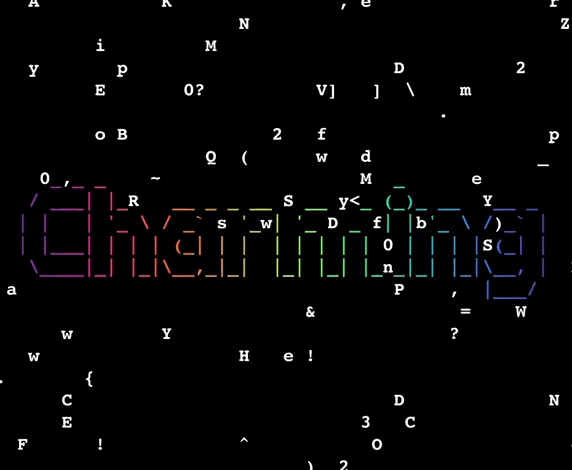
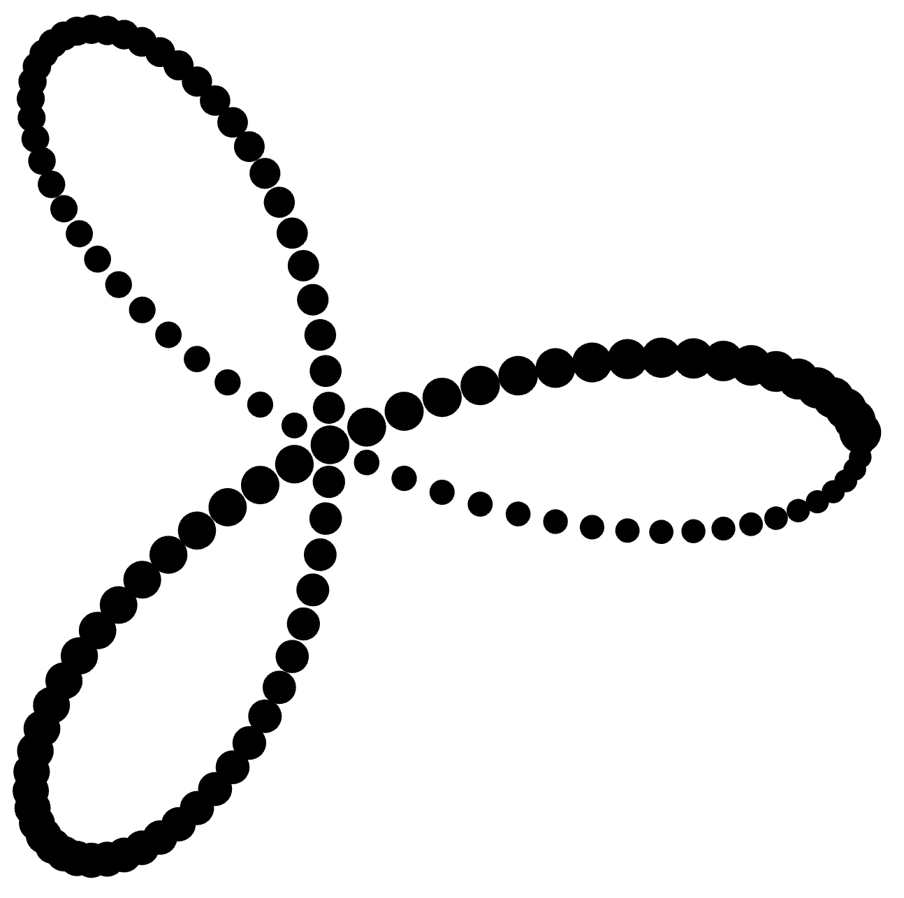
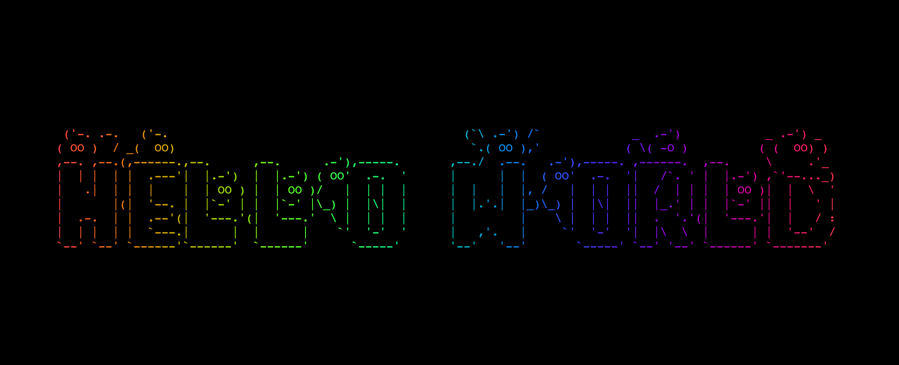
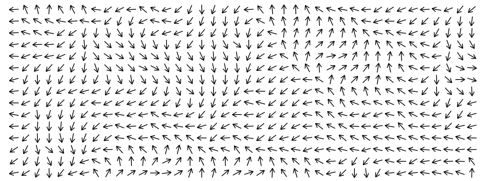
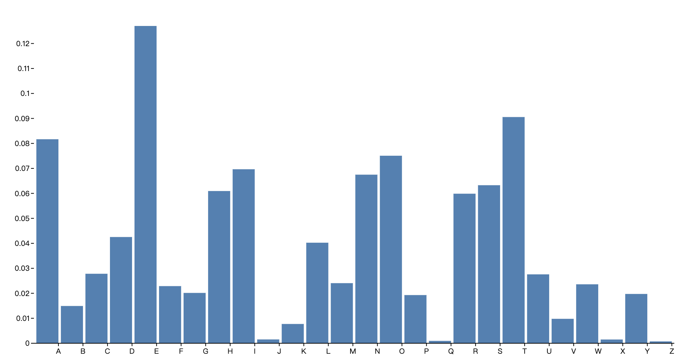
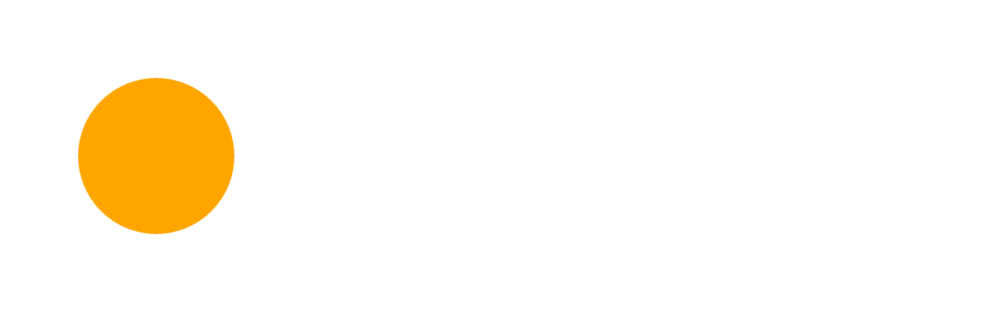
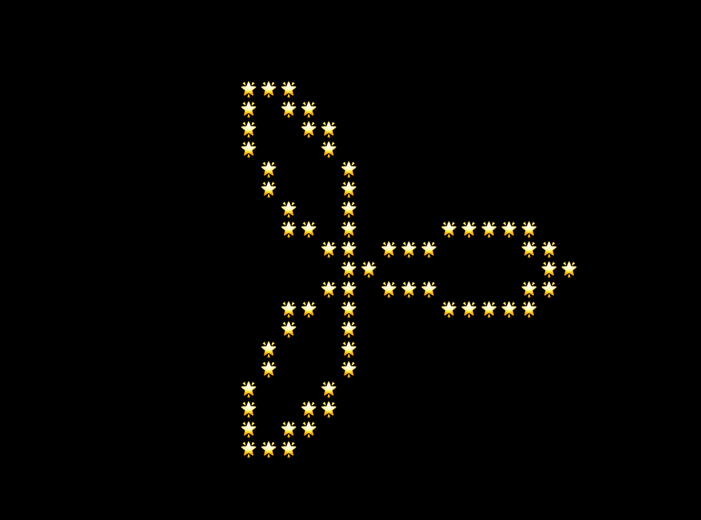

# Charming: Charming Computing

**Charming** is a free, open-source, creative code language for Charming Computing, which means making arts by computational algorithm. It has **declarative**, **data-driven**, concise, inclusive, yet expressive API inspired by [G2.js](https://github.com/antvis/G2), [D3.js](https://github.com/d3) and [P5.js](https://p5js.org/).

The data-driven API style endows Charming with the potential for **high performance**, as it can take advantage of WebGL's [batch rendering](https://developer.mozilla.org/en-US/docs/Web/API/ANGLE_instanced_arrays/drawArraysInstancedANGLE) technique: rendering hundreds to thousands of objects or elements with just a single draw call. At the same time, some GLSL properties can be defined to offload expensive calculations to the GPU, thereby significantly increasing the FPS.

<a href="https://observablehq.com/d/86d2c1fe79fac300"></a>

In addition to high performance, Charming focuses on making **ASCII art** accessible for artists, designers, educators, beginners, and anyone else! It provided a consistent API for both styles, and the [terminal canvas](./src/terminal/) for ASCII art is embedded in JavaScript and uses a [software renderer](./rust/) written in Rust compiled to WASM, to gain high performance hopefully.

<a href="https://observablehq.com/d/9e951c5e9d721ef5"></a>

Moreover, Charming also puts strong emphasis on **lightweight**: the [core bundle](https://cdn.jsdelivr.net/npm/@charming-art/charming/dist/cm.core.umd.min.js) is just 23kb minified. ([Smaller libraries have smaller carbon footprint!](https://observablehq.com/@mrchrisadams/carbon-footprint-of-sending-data-around)) With that in mind, Charming is designed to be flexible, incrementally adoptable and supports fully [tree shaking](https://developer.mozilla.org/en-US/docs/Glossary/Tree_shaking). It's also means that Charming is **beginner friendly**, because you don't have to start by diving into complex concepts: think of it as a collection of syntactic sugars for [Canvas API](https://developer.mozilla.org/en-US/docs/Web/API/Canvas_API).

Most importantly, our hope with Charming is that you spend less time wrangling the machinery of programming and more time "using computing to tell stories". Or put more simply: **with Charming, you'll express more, more easily.** If you are new to Charming, we highly recommend first reading this article to introduce Charming's [inspiration and features](#why-is-charming), as well as core concepts:

- [App](#app) - rendering app to DOM and animating it
- [Flow](#flow) - binding data to shapes
- [Process](#process) - preparing data to be rendered
- [Shape](#shape) - appending geometric elements to canvas
- [Transform](#transform) - deriving shape attribute values
- [Scale](#scale) - mapping abstract data to visual representation
- [Event](#event) - handling hooks and events
- [Prop](#prop) - returning properties of the app

And there are [a plenty of examples](https://observablehq.com/d/2f9bf9f52cb24090) to get started with.

## Installing

Charming is typically installed via a package manager such as Yarn or NPM.

```bash
yarn add @charming-art/charming
```

```bash
npm install @charming-art/charming
```

Charming can then imported as a namespace:

```js
import * as cm from "@charming-art/charming";
```

In vanilla HTML, Charming can be imported as an ES module, say from jsDelivr:

```html
<script type="module">
  import * as cm from "https://cdn.jsdelivr.net/npm/@charming-art/charming/+esm";

  const app = cm.app();

  // ...

  document.body.append(app.render().node());
</script>
```

Charming is also available as a UMD bundle for legacy browsers.

```html
<script src="https://cdn.jsdelivr.net/npm/@charming-art/charming"></script>
<script>
  const app = cm.app();

  // ...

  document.body.append(app.render().node());
</script>
```

## Quick Examples



```js
import * as cm from "@charming-art/charming";

const app = cm.app({
  width: 640,
  height: 640,
});

app
  .data(cm.range(240))
  .process(cm.map, (_, i, data) => (i * Math.PI * 2) / data.length)
  .append(cm.circle, {
    x: (t) => Math.cos(t) * Math.cos(t * 3),
    y: (t) => Math.sin(t) * Math.cos(t * 3),
    r: (_, i) => i,
  })
  .transform(cm.mapPosition, { padding: 15 })
  .transform(cm.mapAttrs, {
    r: { range: [1, 15] },
  });

document.body.appendChild(app.render().node());
```



```js
import * as cm from "@charming-art/charming";

const app = cm.app({
  width: 1200,
  renderer: await cm.terminal(),
});

app.append(cm.text, {
  text: "hello world",
  x: app.prop("width") / 2,
  y: app.prop("height") / 2,
  fill: cm.gradientSineBowX(),
  textAlign: "center",
  textBaseline: "middle",
  fontFamily: cm.fontGhost(),
});

document.body.appendChild(app.render().node(()));
```

## Why is Charming?

As I began my journey into computational art, I found [P5.js](https://p5js.org/) and [Processing](https://processing.org/) to be excellent starting points. Their artist-centered APIs really helped me get stuff drawn onto the screen quick and easy, allowing me to focus on creative expression. And I quickly publish a series of artworks on [OpenProcessing](https://openprocessing.org/user/144707?view=sketches&o=25), instead of spending time on wondering why the computer didn't work as I expected, before my time or patience run out. Additionally, I also designed a creative coding language [Charming.py](https://github.com/charming-art/charming-py) with the same style of APIs, for ASCII art in the terminal.

However, when I became a front-end engineer in the field of visualization, I noticed a distinct shift in programming paradigms for both visualization grammars and front-end frameworks: from **imperative** to **declarative**. Declarative grammars can accelerate development, facilitate retargeting across platforms, and allow language-level optimizations. While P5.js, as the computational art framework for the web, is still imperative and I found myself using it less and less as I tasted the benefits of declarative programming. So I began to ponder whether it was possible to design and implement a declarative grammar specifically for computational art or creative coding?

After about two year's experience developing and maintaining the new 5.0 version of [G2](https://github.com/antvis/G2), I learned a lot from the complete process of designing a new grammar. At the same time, I had observed a commonality between visualization and generative art: they are both **data-driven** to some extent. The difference is that visualization(information visualization more specifically) is typically driven by data derived from daily life activities, while computational art is driven by data generated by algorithm or computing.

Building on this observation, I established the foundational structure of Charming's declarative grammar, and as I progressed, I discovered additional advantages. Declarative grammar decouple specification (the what) from execution (the how). This approach not only make code more predictable, but also diversifies the underlying rendering implementations. For example, it enables 2D primitives to utilize WebGL for improved performance instead of the conventional Canvas, and it allows shapes to be transformed into ASCII art by a terminal renderer, thereby broadening the spectrum of possible artistic expressions.

In addition to the mentioned features, Charming also incorporates best practices from G2.js and valuable parts from [D3.js](https://d3js.org/). Furthermore, it address and mitigate some common issues found in P5.js, including namespace pollution, excessive bundle size, and restrictions on API usage contexts.

It is important to emphasize that Charming remains committed to P5.js's core principle: **to be beginner friendly**. Beyond keeping the APIs concise and intuitive, Charming will place a significant focus on teaching, recognizing it as the most influential facet of tool building.

### Charming is declarative

Charming's atomic operand is **flow**: a container hold data and shapes. **Operators** act on flow, modifying content. The instance _app_, creating by _cm.app_, also serving as a namespace, provides _datum_ and _data_ methods for creating flows and placing values into them.

Any number of **operators** can be applied to selected data. The **process** operators pipe data through a series of pure functions to prepare data for rendering, such _cm.map_, _cm.each_, and _cm.filter_. The **append** operators add a new shape for each processed datum in this flow, extracting columns of data and assigning them to shape attributes, thus allowing the the convenient creation of nested structures. The **transform** operators derives and modifies extracted shape attribute values before committing to the **renderer**.

Charming supports method chaining for brevity when applying multiple operators: the operator return value is a new flow. This allows authoring computational art declaratively and a clear relationship between the raw data and the drawn graphics can be seen through the declared operators.

For example, to draw circles positioned by a curve function, with radius and index maintaining a positive correlation:

```js
// Import the methods from the charming module into the namespace cm.
import * as cm from "@charming-art/charming";

// Create a app.
const app = cm.app({
  width: 640,
  height: 640,
});

app
  // Create a flow containing an array of indices: [0, 1, 2, ..., 239].
  .data(cm.range(240))
  // Transform indices to angles.
  .process(cm.map, (_, i, data) => (i * Math.PI * 2) / data.length)
  // Bind shapes with angles, and invoke the callback on each angle
  // to extract columns for each attribute.
  .append(cm.circle, {
    x: (t) => Math.cos(t) * Math.cos(t * 3),
    y: (t) => Math.sin(t) * Math.cos(t * 3),
    r: (_, i) => i,
  })
  // Map abstract positions(x, y) attribute columns to
  // visual canvas dimensions with padding setting to 15.
  .transform(cm.mapPosition, { padding: 15 })
  // Map abstract radius(r) column to visual values range from 1 to 15.
  .transform(cm.mapAttrs, { r: { range: [1, 15] } });

// Render shapes to canvas and mount it to the document's body.
document.body.appendChild(app.render().node());
```


### Charming is high performance

By decoupling specification (the what) from execution (the how), Charming can use **WebGL** to render shapes. Compared to traditional rendering technologies like Canvas, where each shape requires an individual draw call, WebGL's [batch rendering](https://developer.mozilla.org/en-US/docs/Web/API/ANGLE_instanced_arrays/drawArraysInstancedANGLE) technique allows for the rendering of hundreds or even thousands of similar objects in a single draw call. This cuts down communication overhead between the CPU and GPU, thus enhancing rendering efficiency. Batch rendering is particularly well-suited for computational art, as algorithms often generate a large number of similar graphics. Meanwhile Charming's _flow_ operand is perfect for batch rendering, as it naturally groups similar objects together without introducing additional overhead.

In addition to optimizing rendering, Charming further enhances performance by offloading expensive computations to the GPU, thereby optimizing calculation efficiency. **GLSL attributes** can be conveniently defined using _cm.glsl_, a tagged template literal specifically for GLSL that supports the interpolation of dynamic and non-serializable _JavaScript numbers_. Each GLSL attribute ought to be encapsulated within a GLSL function that carries the _name_ of the corresponding attribute. This function is invoked with each data item(_d_) hold by the flow and is expected to return a _value_ of the specified attribute type. Charming enables moving expensive computations into GLSL attributes, which are then compiled into shader programs, allowing the GPU to handle these operations efficiently.

[For example](https://observablehq.com/d/86d2c1fe79fac300), to render specific number of circles while dynamically updating their positions, strokes and radii using trigonometric functions. While the Canvas renderer can maintain 60 FPS for up to _5.5k_ circles, the WebGL renderer can sustain the same 60 FPS for as many as _22k_ circles. Moreover, when faced with the task of rendering _100k_ circles, the WebGL renderer fails to draw them, but WebGL combined with GLSL attributes can still manage to render at a reduced frame rate of 10 FPS.

```js
import * as cm from "@charming-art/charming";

const width = 700;
const height = 700;
const count = 20000;
const theta = cm.range(count, 0, cm.TWO_PI);
const app = cm.app({
  width,
  height,
  renderer: cm.webgl(), // Use WebGL renderer.
});

app.on("update", update).start();

function update(app) {
  const time = app.prop("frameCount") / 50;
  const scale = 300;

  app.append(cm.clear, { fill: "black" });

  app
    // Bind angles.
    .data(theta)
    // Define a set of GLSL attributes and interpolate certain
    // JavaScript constants or variables into them.
    .append(cm.circle, {
      position: cm.glsl`vec2 position(float theta) {
        vec2 xy = vec2(
          cos(theta), 
          sin(theta)) * (0.6 + 0.2 * cos(theta * 6.0 + cos(theta * 8.0 + ${time}))
        );
        return xy * ${scale} + vec2(${width / 2}, ${height / 2});
      }`,
      r: cm.glsl`float r(float theta) {
        float d = 0.2 + 0.12 * cos(theta * 9.0 - ${time} * 2.0);
        return d * ${scale};
      }`,
      stroke: cm.glsl`vec4 stroke(float theta) {
        float th = 8.0 * theta + ${time} * 2.0;
        vec3 rgb = 0.6 + 0.4 * vec3(
          cos(th),
          cos(th - ${Math.PI} / 3.0),
          cos(th - ${Math.PI} * 2.0 / 3.0)
        );
        return vec4(rgb, 0.0);
      }`,
      strokeOpacity: cm.glsl`float strokeOpacity(float theta) {
        return 0.15 * 2000.0 / ${count};
      }`,
    });
}
```


Please note that _cm.webgl_ is currently in the experimental stage, having only implemented the circle shape as a proof of concept. The implementation for the remaining shapes is expected to be released soon.

### Charming supports ASCII art

Charming is designed to offer users a broader spectrum of artistic expression. This is grounded in the belief that creativity lies in changing the relationship between content and form, thereby shifting the user's perception of information, as noted by John Maeda. Supporting **ASCII art** is a good example, which is the art form came into being during the early days of computers when graphic displays were limited or non-existent.

Charming introduces the **terminal renderer**, enabling users to create ASCII art as effortlessly as they would with traditional art forms. Instead of using pixels, this renderer takes a unique approach by shifting the coordinate system from pixels to cells, allowing shapes to be rendered into printable characters and emojis. Each 'cell' in the ASCII art can be defined by a _character (ch)_, with a _foreground color (fg)_ and _background color (bg)_, vastly enhancing the expressive potential compared to the traditional color encoding methods.

[For example](https://observablehq.com/d/9e951c5e9d721ef5), to draw text in the style of ASCII art and render points into random characters to simulate white noise effect:

```js
let characters;
const app = cm.app({
  width: 600,
  height: 400,
  // Use terminal renderer.
  renderer: await cm.terminal(),
});

app.on("update", update).start();

function update(app) {
  const width = app.prop("width");
  const height = app.prop("height");

  if (!characters) {
    characters = cm.cross(cm.range(width), cm.range(height)).map((d) => ({ x: d[0], y: d[1] }));
  }

  app.append(cm.clear, { fill: "black" });

  // Append text in the style of ASCII art.
  app.append(cm.text, {
    text: "Charming",
    x: width / 2,
    y: height / 2,
    textAlign: "center",
    textBaseline: "middle",
    fill: cm.gradientRainBowX(), // Define gradient color.
  });

  // Append points rendered into characters.
  app
    .data(characters)
    .process(cm.each, (d) => {
      if (d.lifespan) return d.lifespan--;
      d.stroke = cm.cfb(cm.randomChar());
      d.lifespan = cm.randomInt(3, 10);
    })
    .process(cm.filter, (d) => cm.random(10) < 0.7)
    .append(cm.point, {
      x: (d) => d.x,
      y: (d) => d.y,
      stroke: (d) => d.stroke,
    });
}
```


In addition to supporting ASCII Art, Charming will also be able to support a variety of styles in the future, such as [hand-drawn](https://github.com/rough-stuff/rough) style. Why not have a little fun? Life' not just about work, you know.

### Charming is composable

Inspired by component philosophy in [React](https://react.dev/), Charming makes it easy to define custom composite shape through pure function, such as this arrow shape:

```js
function arrow(flow, { length, angle, x, y, rotate, ...options }) {
  const group = flow.append(cm.group, { x, y, rotate });
  const l1 = length.map((d) => d / 2);
  const l2 = length.map((d) => -d / 2);
  const a1 = angle.map((d) => d);
  const a2 = angle.map((d) => -d);
  group.append(cm.link, { x: l2, y: 0, x1: l1, y1: 0, ...options });
  group.append(cm.link, { x: 0, y: 0, x1: l1, y1: 0, rotate: a2, transformOrigin: "end", ...options });
  group.append(cm.link, { x: 0, y: 0, x1: l1, y1: 0, rotate: a1, transformOrigin: "end", ...options });
}
```

You can use this composite shape like any built-in shape. [For example](https://observablehq.com/d/82d4b52694a7f370), to draw a flow field:

```js
app
  .data(fields)
  // Use arrow shape.
  .append(arrow, {
    x: (d) => d.x * size + size / 2,
    y: (d) => d.y * size + size / 2,
    length: size * 0.8,
    angle: Math.PI / 6,
    rotate: (d) => d.value,
  })
  .transform(cm.mapAttrs, {
    rotate: { range: [0, cm.TWO_PI] },
  });
```



Simple components gain power through composition, you can even define more complex shape to extend Charming's abilities. [For example](https://observablehq.com/@pearmini/bar), to define and use a barY shape to plot a bar chart:

```js
app.data(data).append(barY, {
  x: (d) => d.letter,
  y: (d) => d.frequency,
});
```



### Charming is beginner friendly

### Charming embraces existing libraries

### Compared to P5.js

### Compared to D3.js

## API Reference

The core concepts of Charming, which are included in [core bundle](https://cdn.jsdelivr.net/npm/@charming-art/charming/dist/cm.core.umd.min.js):

- [App](#app) - rendering app to DOM and animating it
- [Flow](#flow) - binding data to shapes
- [Process](#process) - preparing data to be rendered
- [Shape](#shape) - appending geometric elements to canvas
- [Transform](#transform) - deriving shape attribute values
- [Scale](#scale) - mapping abstract data to visual representation
- [Event](#event) - handling hooks and events
- [Prop](#prop) - returning properties of the app

The advanced concepts of Charming, which are included in [full bundle](https://cdn.jsdelivr.net/npm/@charming-art/charming/dist/cm.umd.min.js):

- [Renderer](#renderer) - different rendering technologies and styles
- [Color](#color) - defining colors for shapes
- [Array](#array) - array generation and manipulation
- [Math](#math) - processing numbers, randomness, etc.
- [Constant](#constant) - useful constants
- [Font](#font) - fonts for ASCII art text
- [Gradient](#gradient) - gradient fills for ASCII art text
- [Helper](#helper) - useful unities
- [Vector](#vector) - basics for simulating physical laws

### App

Rendering app to DOM and animating it.

<a name="cm-app" href="#cm-app">#</a> _cm_.**app**(_[options]_)

Constructs a new app with the specified _options_. If no argument is specified, constructs with default options.

All the apps support the following options:

- **width** - the outer width of the app, number in pixels
- **height** - the outer height of the app, number in pixels
- **frameRate** - the number of frames to draw per second
- **renderer** - the [renderer](#renderer) to draw shapes and handle events, defaults to [canvas](cm-canvas) renderer

```js
const app = cm.app({
  width: 600,
  height: 400,
  renderer: cm.canvas(),
});
```

The _width_ and _height_ options can also be specified as strings representing the number of columns and rows respectively when using a [terminal](#cm-terminal) renderer for apps.

```js
const app = cm.app({
  width: "30",
  height: "20",
  renderer: await cm.terminal(),
});
```

Apps with [terminal](#cm-terminal) renderer support the extra options:

- **fontSize** - the font size used to render text, see [CSS font-size](https://developer.mozilla.org/en-US/docs/Web/CSS/font-size)
- **fontWeight** - the font weight used to render text, see [CSS font-weight](https://developer.mozilla.org/en-US/docs/Web/CSS/font-weight)
- **fontFamily** - the font family used to render text, see [CSS font-family](https://developer.mozilla.org/en-US/docs/Web/CSS/font-family)
- **mode** - the render mode, _single_ or _double_, defaults to _single_

```js
const app = cm.app({
  renderer: await cm.terminal(),
  fontSize: 20,
  fontWeight: "bold",
  fontFamily: "Georgia, serif",
  mode: "double",
});
```

If _mode_ is _single_, a cell in terminal renders both single-width and double-width character once . If _mode_ is _double_, a cell in terminal renders single-width character twice and double-width character once.

Single-width characters include characters like _A_, _a_, _1_, _@_, etc,. Double-width characters are characters include characters like _中_, _🚀_ and strings made of two single-width characters like _AB_. Double mode aims to address the overlapping issues that arise from the inconsistent widths of single-width and double-width characters.

<a name="app-data" href="#app-data">#</a> _app_.**data**(_data_)

Appends a new flow with the specified array of _data_ to the root flow of app, returning the new flow.

```js
app.data([1, 2, 3]);
```

<a name="app-datum" href="#app-datum">#</a> _app_.**datum**(_[datum]_)

Appends a new flow with an array containing the specified _datum_ to the root flow app, returning the new flow.

```js
app.datum(1);
```

The shorthand is thus equivalent to:

```js
app.data([1]);
```

If no argument is specified, return groups of this app:

```js
app.datum(); // [[1]]
```

<a name="app-append" href="#app-append">#</a> _app_.**append**(_shape[, options]_)

Appends a shape with the specified options to this app, returning the new flow that contains the shape. Each shape has its own options, and different shape types support different options. See the respective [shape](#shape) type for details.

```js
app.append(cm.circle, { x: 100, y: 100, r: 50, fill: "orange" });
```

<a name="app-render" href="#app-render">#</a> _app_.**render**()

Renders shapes in flows to canvas and removes existing flows, returning this app.

```js
app.append(cm.circle, {
  x: cm.random(50, 100),
  y: cm.random(50, 100),
  r: 25,
  fill: "orange",
});

app.render();

app.append(cm.circle, {
  x: cm.random(50, 100),
  y: cm.random(50, 100),
  r: 25,
  fill: "steelblue",
});

app.render();
```

<a name="app-start" href="#app-start">#</a> _app_.**start**()

Starts this app and returns it, firing [_update_](#event-update) event repeatedly until calling [app.stop](#app-stop). This allows this app to invoke the update callback every delay milliseconds, which is controlled by the [frameCount](#cm-app) option. Note that [app.render](#app-render) will be invoked automatically at the end of each frame, so there is no need to call it explicitly. For example, to draw a moving rect:

```js
let x = 0;

function update() {
  app.append(cm.rect, {
    x: x++,
    y: 0,
    width: 100,
    height: 50,
  });
}

app.on("update", update);
app.start();
```

<a name="app-stop" href="#app-stop">#</a> _app_.**stop**()

Stops this app and returns it, cancelling firing [_update_](#event-update), thereby stops the animation.

```js
app.on("update", update);
app.start();

// Stops animation after 5 seconds.
setTimeout(() => app.stop(), 5000);
```

<a name="app-dispose" href="#app-dispose">#</a> _app_.**dispose**()

Disposes this app and returns it, stopping the timer to firing [_update_](#event-update) event and removing all event listeners.

```js
app.on("update", update);
app.on("mouseMove", mouseMove);
app.dispose();
```

<a name="app-node" href="#app-node">#</a> _app_.**node**()

Returns the [canvas element](https://developer.mozilla.org/en-US/docs/Web/HTML/Element/canvas) for drawing shapes.

```js
document.body.append(app.node());
```

<a name="app-prop" href="#app-prop">#</a> _app_.**prop**(_name_)

Returns the property with the _specified_ name for this app. See the respective [property](#prop) name for details.

```js
app.prop("width"); // 640
```

<a name="app-on" href="#app-on">#</a> _app_.**on**(_type, listener_)

Adds a _listener_ for the specified event _type_. Multiple listeners can be registered to receive the same event.

```js
function mouseMove() {}

function mouseMove1() {}

app.on("mouseMove", mouseMove).on("mouseMove", mouseMove1);
```

See the respective [event](#event) type for details.

<a name="app-call" href="#app-call">#</a> _app_.**call**(_callback[, ...argument]_)

Calls the specified _function_ on this app with any optional _arguments_ and returns this app. This is equivalent to calling the function by hand but avoids to break method chaining. For example, to draw two concentric circles in a reusable function:

```js
function ring(app, { x, y, r, r1, fill, fill1 }) {
  app.append(cm.circle, { x, y, r, fill });
  app.append(cm.circle, { x, y, r1, fill2 });
}

ring(app, {
  x: 100,
  y: 100,
  r: 25,
  r1: 50,
  fill: "orange",
  fill1: "steelblue",
});
```

Instead of invoking this function directly on app, now say:

```js
app.call(ring, {
  x: 100,
  y: 100,
  r: 25,
  r1: 50,
  fill: "orange",
  fill2: "steelblue",
});
```

<a name="app-textBBox" href="#app-textBBox">#</a> _app_.**textBBox**(_text_, _textOptions_)

Computes the bounding box for the specified [_textOptions_](#cm-text). The returned bounding box has the following properties:

- **x** - the x coordinate of the text
- **y** - the y coordinate of the text
- **width** - the width of the text
- **height** - the height of the text

```js
const bbox = app.textBBox({
  text: "hello world",
  fontSize: 20,
  fontWeight: "bold",
});
```

### Flow

Binding data to shapes.

<a name="flow-data" href="#flow-data">#</a> _flow_.**data**(_[data]_)

Returns a new flow that contains this specified _data_. The _data_ is specified for each group in this flow.

If the specified _data_ is an array of arbitrary values(e.g. number of objects), sets _[data]_ as the group of this flow.

```js
const group = app.append(cm.group, {
  width: app.prop("width") / 3,
  height: app.prop("heigh") / 3,
});

group.data([1, 2, 3]);
```

If the flow has multiple groups(such as [flow.data](#flow-data) followed by [app.data](#app-data)), then _data_ should typically be specified as a function. The function will be evaluated for each group in order, being passed the group's parent datum(_d_), the group index(_i_), all the groups(_data_) and this flow(_flow_).

```js
app.data(matrix).data((d, i, data, flow) => {});
```

For example, to draw a matrix of characters in a terminal:

```js
const matrix = [
  [" +", "-", "+ "],
  [" |", cm.wch("🚀"), "| "],
  [" +", "-", "+ "],
];

app
  .data(matrix)
  .append(cm.group, { y: (_, i) => i })
  .data((d) => d)
  .append(cm.point, {
    y: 0,
    x: (_, i) => i,
    stroke: (d) => cm.cfb(d),
  });
```

If no argument is specified, return groups of this app:

```js
app.data(); // [...]
```

<a name="flow-datum" href="#flow-datum">#</a> _flow_.**datum**(_value_)

Like [flow.data](#flow-data), except receives a _value_ instead of an array of data.

```js
flow.datum(1);

// Equivalent
flow.data([1]);
```

<a name="flow-process" href="#flow-process">#</a> _flow_.**process**(_process, options_)

Processes the data of this flow with the specified _process_ function receiving the specified _options_, returning a flow with the processed data. It provide a convenient mechanism to manipulate data before calling [flow.append](#flow-append) to bind it with shapes.

For example, to draw a particle system with two shape types:

```js
const groups = app
  .data(particles)
  .process(cm.push, createParticle)
  .process(cm.eachRight, removeDied)
  .process(cm.each, decay)
  .process(cm.each, move);

groups.process(cm.filter, isCircle).append(cm.circle, {});
groups.process(cm.filter, isSquare).append(cm.rect, {});
```

See the respective [process function](#process) for details.

<a name="flow-append" href="#flow-append">#</a> _flow_.**append**(_shape[, options]_)

Appends and binds shapes with the data of this flow, returning a flow with shapes. Shapes are created by the specified _shape_ function with the specified _options_.

Shape function interprets attribute values and invokes the renderer of this flow to draw shapes. See the respective [shape function](#shape) for details. Each shape's options are typically specified as a object with corresponding attribute name.

For each attribute, if the _value_ is constant, all the shapes are given the same attribute value; otherwise, if the _value_ is a function, it is evaluated for each datum, in order, being passed the current datum(_d_), the current index(_i_), the data(_data_) and this flow(_flow_). The function's return value is then used to set each shapes' attribute.

```js
const flow = app.data([1, 2, 3]);

flow.append(cm.circle, {
  x: (d) => d * 100,
  y: (d) => d * 100,
  fill: "red",
});
```

<a name="flow-transform" href="#flow-transform">#</a> _flow_.**transform**(_transform, options_)

Transforms shapes' attribute values with the specified _transform_ function receiving the specified _options_, returning a flow with the transformed attribute values. It provide a convenient mechanism to manipulate attribute values after calling [flow.append](#flow-append) to binding data with shapes.

For example, to map abstract values produced by [Math.sin](https://developer.mozilla.org/en-US/docs/Web/JavaScript/Reference/Global_Objects/Math/sin) into visual values, drawing a sine wave:

```js
app
  .data(cm.range(50, cm.TWO_PI))
  .append(cm.circle, {
    x: (d) => d,
    y: (d) => Math.sin(d),
    r: 20,
    fill: "rgba(175, 175, 175, 0.5)",
    stroke: "#000",
    strokeWidth: 1,
  })
  .transform(cm.mapPosition);
```

See the respective [transform function](#transform) for details.

<a name="flow-call" href="#flow-call">#</a> _flow_.**call**(_callback[, ...argument]_)

Like [app.call](#app-call), except calls on this flow.

```js
function scaleRadius(flow) {
  flow.transform(cm.mapAttrs, {
    r: { range: [10, 15] },
  });
}

app
  .data([1, 2, 3, 4])
  .append(cm.circle, {
    x: 100,
    y: 100,
    r: (d) => d,
    fill: "steelblue",
  })
  .call(scaleRadius);
```

<a name="flow-app" href="#flow-app">#</a> _flow_.**app**()

Returns this app. It helps define some pure functions relaying some properties of this app.

```js
function scale(d, i, data, flow) {
  const app = flow.app();
  const width = app.prop("width");
  return d * width;
}

app.data([0.1, 0.2, 0.3]).process(cm.map, scale);
```

### Process

Preparing data to be rendered.

<a name="cm-each" href="#cm-each">#</a> _cm_.**each**

Calls the specified _function_ on each datum of a flow, and returns a new flow that contains the data. The function is being passed the current datum(_d_), the current index(_i_), the current group(_data_) and the flow(_flow_).

```js
const data = [
  { name: "Locke", number: 4 },
  { name: "Reyes", number: 8 },
  { name: "Ford", number: 15 },
  { name: "Jarrah", number: 16 },
  { name: "Shephard", number: 23 },
  { name: "Kwon", number: 42 },
];

app.data(data).process(cm.each, (d) => d.number * 2);
```

<a name="cm-eachRight" href="#cm-eachRight">#</a> _cm_.**eachRight**

Like [cm.each](#cm-each), except iterates from right to left.

```js
const data = [
  { name: "Locke", number: 4 },
  { name: "Reyes", number: 8 },
  { name: "Ford", number: 15 },
  { name: "Jarrah", number: 16 },
  { name: "Shephard", number: 23 },
  { name: "Kwon", number: 42 },
];

app.data(data).process(cm.eachRight, (d, i, data) => {
  if (d.number > 30) data.splice(i, 1);
});
```

<a name="cm-filter" href="#cm-filter">#</a> _cm_.**filter**

Calls the specified _function_ on each datum of a flow, and returns a new flow that contains the data meeting true condition. The function is being passed the current datum(_d_), the current index(_i_), the current group(_data_) and the flow(_flow_).

```js
const data = [
  { name: "Locke", number: 4 },
  { name: "Reyes", number: 8 },
  { name: "Ford", number: 15 },
  { name: "Jarrah", number: 16 },
  { name: "Shephard", number: 23 },
  { name: "Kwon", number: 42 },
];

app.data(data).process(cm.filter, (d) => d.number % 2 === 0);
```

<a name="cm-map" href="#cm-map">#</a> _cm_.**map**

Calls the specified _function_ on each datum of a flow, and returns a new flow that contains the new data. The function is being passed the current datum(_d_), the current index(_i_), the current group(_data_) and the flow(_flow_).

```js
const data = [
  { name: "Locke", number: 4 },
  { name: "Reyes", number: 8 },
  { name: "Ford", number: 15 },
  { name: "Jarrah", number: 16 },
  { name: "Shephard", number: 23 },
  { name: "Kwon", number: 42 },
];

app.data(data).process(cm.map, (d) => ({ ...d, number: d.number * 2 }));
```

<a name="cm-push" href="#cm-push">#</a> _cm_.**push**

Appends the specified _datum_ to a flow, and returns a new flow that contains the new datum.

If _datum_ is not a function, appends it to all groups.

```js
const data = [
  { name: "Locke", number: 4 },
  { name: "Reyes", number: 8 },
  { name: "Ford", number: 15 },
  { name: "Jarrah", number: 16 },
  { name: "Shephard", number: 23 },
  { name: "Kwon", number: 42 },
];

app.data(data).process(cm.push, { name: "Jim", number: 25 });
```

If the flow has multiple groups(such as [flow.data](#flow-data) followed by [app.data](#app-data)), then _datum_ should typically be specified as a function. The function will be evaluated for each group in order, being passed the group(_group_), the group index(_i_), all the groups(_data_) and this flow(_flow_).

```js
const matrix = [
  [" +", "-", "+ "],
  [" |", cm.wch("🚀"), "| "],
  [" +", "-", "+ "],
];

app
  .data(matrix)
  .append(cm.group, { y: (_, i) => i })
  .data((d) => d)
  .process(cm.push, (group, i, groups) => ` ${i}`);
```

### Shape

Appending geometric elements to canvas, most of shapes support the following attributes:

- **fill** - the fill color
- **fillOpacity** - fill opacity (a number between 0 and 1)
- **stroke** - stroke color
- **strokeWidth** - stroke width (in pixels)
- **strokeOpacity** - stroke opacity (a number between 0 and 1)

<a name="cm-point" href="#cm-point">#</a> _cm_.**point**

Appends dots positioned in _x_ and _y_. In addition to the [standard shape attributes](#shape), the following attributes are supported:

- **x** - the horizontal position, in pixels or in cells
- **y** - the vertical position, in pixels or in cells

```js
app.append(cm.point, { x: 10, y: 10 });
```

<a name="cm-link" href="#cm-link">#</a> _cm_.**link**

Appends straight lines between two points _[x, y]_ and _[x1, y1]_. In addition to the [standard shape attributes](#shape), the following attributes are supported:

- **x** - the starting horizontal position, in pixels or in cells
- **y** - the starting vertical position, in pixels or in cells
- **x1** - the ending horizontal position, in pixels or in cells
- **y1** - the ending vertical position, in pixels or in cells
- **rotate** - the rotation angle in degrees clockwise
- **transformOrigin** - the position of the origin point for rotation, defaults to _start_; _center_ and _end_

```js
app.append(cm.link, { x: 0, y: 0, x1: 100, y1: 100 });
```

<a name="cm-rect" href="#cm-rect">#</a> _cm_.**rect**

Appends rectangles defined by _x_, _y_, _width_ and _height_. In addition to the [standard shape attributes](#shape), the following attributes are supported:

- **x** - the horizontal position, in pixels or cells
- **y** - the vertical position, in pixels or cells
- **width** - the rectangle width, in pixels or cells
- **height** - the rectangle height, in pixels or cells
- **anchor** - how to position the rectangle, defaults to _start_; _center_
- **rotate** - the rotation angle in degrees clockwise

```js
app.append(cm.rect, { x: 10, y: 10, width: 50, height: 40 });
```

<a name="cm-circle" href="#cm-circle">#</a> _cm_.**circle**

Appends circles positioned in _x_ and _y_. In addition to the [standard shape attributes](#shape), the following attributes are supported:

- **x** - the horizontal position, in pixels or cells
- **y** - the vertical position, in pixels or cells
- **r** - the circle radius, in pixels or cells

```js
app.append(cm.circle, { x: 50, y: 50, r: 30 });
```

<a name="cm-triangle" href="#cm-triangle">#</a> _cm_.**triangle**

Appends triangles defined by _x_, _y_, _x1_, _y1_, _x2_, _y2_. In addition to the [standard shape attributes](#shape), the following attributes are supported:

- **x** - the first horizontal position, in pixels or cells
- **y** - the first vertical position, in pixels or cells
- **x1** - the second horizontal position, in pixels or cells
- **y1** - the second vertical position, in pixels or cells
- **x2** - the third horizontal position, in pixels or cells
- **y2** - the third vertical position, in pixels or cells

```js
app.append(cm.triangle, { x: 0, y: 0, x1: 10, y1: 0, x2: 10, y2: 10 });
```

<a name="cm-polygon" href="#cm-polygon">#</a> _cm_.**polygon**

Appends polygons defined by _x_ and _y_. In addition to the [standard shape attributes](#shape), the following attributes are supported:

- **x** - the horizontal positions of control points, in pixels or cells clockwise
- **y** - the vertical positions of control points, in pixels or cells clockwise

If appends one polygon defined by a column of _x_ and a of _y_, assigns columns to its x and y attribute respectively.

```js
app.append(cm.polygon, {
  x: [0, 10, 10],
  y: [0, 0, 10],
});
```

If only appends one polygon defined by an array of points _[x, y]_ or objects, assigns accessors return number to its x and y attribute respectively.

```js
const polygon = [
  [0, 0],
  [10, 0],
  [10, 10],
];

app.data(polygon).append(cm.polygon, {
  d => d[0],
  d => d[1],
})
```

If appends multiple polygons defined by an array of objects, assigns accessors returns an array of numbers to its x and y attribute respectively.

```js
const polygons = [
  { X: [0, 10, 10], Y: [0, 0, 10] },
  { X: [20, 30, 30], Y: [0, 0, 10] },
];

app.data(polygons).append(cm.polygon, {
  d => d.X,
  d => d.Y,
})
```

<a name="cm-line" href="#cm-line">#</a> _cm_.**line**

Appends draw two-dimensional lines defined by _x_ and _y_. In addition to the [standard shape attributes](#shape), the following attributes are supported:

- **x** - the horizontal positions of control points, in pixels or cells
- **y** - the vertical positions of control points, in pixels or cells

If appends one line defined by a column of _x_ and a of _y_, assigns columns to its x and y attribute respectively.

```js
app.append(cm.line, {
  x: [0, 10, 20],
  y: [10, 5, 15],
});
```

If only appends one line defined by an array of points _[x, y]_ or objects, assigns accessors return number to its x and y attribute respectively.

```js
const line = [
  [0, 10],
  [10, 5],
  [20, 15],
];

app.data(line).append(cm.line, {
  d => d[0],
  d => d[1],
})
```

If appends multiple lines defined by an array of objects, assigns accessors returns an array of numbers to its x and y attribute respectively.

```js
const lines = [
  { X: [0, 10, 20], Y: [10, 5, 15] },
  { X: [20, 40, 35], Y: [10, 5, 15] },
];

app.data(lines).append(cm.line, {
  d => d.X,
  d => d.Y,
})
```

<a name="cm-path" href="#cm-path">#</a> _cm_.**path**

Appends path defined by _d_. In addition to the [standard shape attributes](#shape), the following attributes are supported:

- _d_: an array of [path commands](https://developer.mozilla.org/en-US/docs/Web/SVG/Attribute/d)

If appends one path, assigns the specified path commands to its d attribute.

```js
app.append(cm.path, {
  d: [["M", 0, 0], ["L", 10, 0], ["L", 10, 10], ["Z"]],
});
```

If appends multiple paths, assigns accessors returns an array of path commands to its d attribute.

```js
const paths = [
  [["M", 0, 0], ["L", 10, 0], ["L", 10, 10], ["Z"]],
  [["M", 10, 0], ["L", 20, 10], ["L", 20, 10], ["Z"]],
];

app.data(paths).append(cm.path, { d: (d) => d });
```

<a name="cm-text" href="#cm-text">#</a> _cm_.**text**

Appends texts at given position in _x_ and _y_. In addition to the [standard shape attributes](#shape), the following attributes are supported:

- **x** - the horizontal position
- **y** - the vertical position
- **text** - the text contents (a string)
- **fontSize** - the font size in pixels; defaults to 10
- **fontFamily** - the font name
- **fontWeight** - the [font weight](https://developer.mozilla.org/en-US/docs/Web/CSS/font-weight), defaults to normal
- **textBaseline** - the line anchor for vertical position; _top_, _bottom_, or _middle_
- **textAlign** - the [text align](https://developer.mozilla.org/en-US/docs/Web/CSS/text-align) for horizontal position; _start_, _end_, or _middle_

<a name="cm-group" href="#cm-group">#</a> _cm_.**group**

Appends groups at given position in _x_ and _y_. In addition to the [standard shape attributes](#shape), the following attributes are supported:

- **y** - the horizontal position
- **x** - the vertical position
- **rotate** - the rotation angle in degrees clockwise

All the child shapes are applied translate(_x_, _y_) and rotate(_rotate_) transformations.

```js
const group = app.group({
  width: 100,
  height: 100,
});

group.append(cm.point, {
  x: 0,
  y: 0,
  r: 10,
});
```

<a name="cm-clear" href="#cm-clear">#</a> _cm_.**clear**

Appends clear shape to clear the canvas background with the _specified_ color. The following attributes are supported:

- **fill** - the clear color

<a name="cm-composite-shape" href="#cm-composite-shape">#</a> **function**(_flow_, _value_)

Defines a composite shape by a _function_, passing the current flow(_flow_) and attribute value(_value_).

```js
// Defines a composite shape.
function arrow(flow, { length, angle, x, y, rotate, ...options }) {
  const group = flow.append(cm.group, { x, y, rotate });
  const l1 = length.map((d) => d / 2);
  const l2 = length.map((d) => -d / 2);
  const a1 = angle.map((d) => d);
  const a2 = angle.map((d) => -d);
  group.append(cm.link, { x: l2, y: 0, x1: l1, y1: 0, ...options });
  group.append(cm.link, { x: 0, y: 0, x1: l1, y1: 0, rotate: a2, transformOrigin: "end", ...options });
  group.append(cm.link, { x: 0, y: 0, x1: l1, y1: 0, rotate: a1, transformOrigin: "end", ...options });
}

// Uses a composite shape.
app
  .data(fields)
  .append(arrow, {
    x: (d) => d.x * size + size / 2,
    y: (d) => d.y * size + size / 2,
    length: size * 0.8,
    angle: Math.PI / 6,
    rotate: (d) => d.value,
  })
  .transform(cm.mapAttrs, {
    rotate: {
      domain: [0, 1],
      range: [0, cm.TWO_PI],
    },
  });
```

### Transform

Deriving shape attribute values.

<a name="cm-mapAttrs" href="#cm-mapAttrs">#</a> _cm_.**mapAttrs**

Maps abstract attributes to visual attributes with scales. Each scale's options are specified as a nested options object with the corresponding attribute name.

```js
app
  .append(cm.circle, {
    x: (d) => d[0],
    y: (d) => d[1],
  })
  .transform(cm.mapAttrs, {
    x: {}, // scale for x attribute
    y: {}, // scale for y attribute
  });
```

A scale's domain is typically inferred automatically. You can custom a scale explicitly using these options:

- **scale** - [scale](#scale), defaults to [scaleLinear](#cm-scaleLinear)
- **domain** - abstract values, typically _[min, max]_
- **range** - visual values, typically _[min, max]_

```js
app
  .append(cm.circle, {
    x: (d) => d[0],
    y: (d) => d[1],
  })
  .transform(cm.mapAttrs, {
    x: {
      scale: cm.scaleLog,
      range: [0, app.prop("height")],
    },
  });
```

<a name="cm-mapPosition" href="#cm-mapPosition">#</a> _cm_.**mapPosition**

Map abstract position to visual position. Like [mapAttrs](#cm-mapAttrs), but only maps position attributes to corresponding dimension range.

For x attributes, such as x and x1, the scale's range is _[0, app.prop("width")]_ by default. For y attributes, such as y and y1, the scale's range is _[0, app.prop("height")]_ by default.

- **scaleX** - [scale](#scale) for x attributes, defaults to [scaleLinear](#cm-scaleLinear)
- **scaleY** - [scale](#scale) for y attributes, defaults to [scaleLinear](#cm-scaleLinear)
- **domainX** - abstract values for x attributes, typically _[min, max]_
- **domainY** - abstract values for y attributes, typically _[min, max]_
- **reverseX** - reverses range for x attributes, defaults to false
- **reverseY** - reverses range for y attributes, defaults to false
- **padding** - space between shapes and border, defaults to 0

```js
app
  .append(cm.line, {
    x: (d) => d[0],
    y: (d) => d[0],
  })
  .transform(cm.mapPosition, {
    scaleX: cm.scaleLog,
    reverseY: true,
    padding: 15,
  });
```

### Scale

Mapping abstract data to visual representation.

<a name="cm-scaleLinear" href="#cm-scaleLinear">#</a> _cm_.**scaleLinear**(_domain, range_)

Constructs a new linear scale with the specified _domain_ and _range_. Linear scales map a continuous, quantitative to a continuous output using a linear transformation.

```js
const scale = cm.scaleLinear([0, 1], [0, 100]);
scale(0); // 0;
scale(0.5); // 50;
scale(1); // 100;
```

<a name="cm-scaleSqrt" href="#cm-scaleSqrt">#</a> _cm_.**scaleSqrt**(_domain, range_)

Constructs a new sqrt scale with the specified _domain_ and _range_. Sqrt scales are similar to [linear scale](#cm-scaleLinear), except a square root transform is applied to the input domain value before the output range is computed.

```js
const scale = cm.scaleSqrt([0, 1], [0, 100]);
scale(0.09); // 30
scale(0.64); // 80
scale(0.81); // 90
```

<a name="cm-scaleLog" href="#cm-scaleLog">#</a> _cm_.**scaleLog**(_domain, range_)

Constructs a new log scale with the specified domain and range. Log scales are similar to [linear scale](#cm-scaleLinear), except a logarithmic transform transform is applied to the input domain value before the output range is computed.

```js
const scale = cm.scaleLog([1, 10], [0, 960]);
```

### Event

Handling hooks and events.

<a name="event-update" href="#event-update">#</a> _app_.**on**(_"update", callback_)

The _update_ event is fired repeatedly until [app.stop](#app-stop) is called after calling [app.start](#app-start). For example, to draw a moving rect:

```js
let x = 0;

function update() {
  app.append(cm.rect, {
    x: x++,
    y: 0,
    width: 100,
    height: 50,
  });
}

app.on("update", update);
```

<a name="event-mouseDown" href="#event-mouseDown">#</a> _app_.**on**(_"mouseDown", callback_)

The _mouseDown_ event is fired when a mouse button is pressed. For example, to change the background color:

```js
let background = "red";

function mouseDown() {
  background = "blue";
}

app.on("mouseDown", mouseDown);
```

<a name="event-mouseUp" href="#event-mouseUp">#</a> _app_.**on**(_"mouseUp", callback_)

The _mouseUp_ event is fired when a mouse button is released. For example, to change the background color:

```js
let background = "red";

function mouseUp() {
  background = "blue";
}

app.on("mouseUp", mouseUp);
```

<a name="event-mouseClick" href="#event-mouseClick">#</a> _app_.**on**(_"mouseClick", callback_)

The _mouseClick_ event is fired when a mouse button is clicked. For example, to change the background color:

```js
let background = "red";

function mouseClick() {
  background = "blue";
}

app.on("mouseClick", mouseClick);
```

<a name="event-beforeEach" href="#event-beforeEach">#</a> _app_.**on**(_"beforeEach", callback_)

The _beforeEach_ event is fired before each [update event](#event-update) is fired. For example, to begin measuring frame rate by [stats.js](https://github.com/mrdoob/stats.js):

```js
function measure(app) {
  // ...
  app.on("beforeEach", () => {
    stats.begin();
  });
}

app.call(measure);
```

<a name="event-afterEach" href="#event-afterEach">#</a> _app_.**on**(_"afterEach", callback_)

The _afterEach_ event is fired after each [update event](#event-update) is fired. For example, to end measuring frame rate by [stats.js](https://github.com/mrdoob/stats.js):

```js
function measure(app) {
  // ...
  app.on("afterEach", () => {
    stats.end();
  });
}

app.call(measure);
```

<a name="event-beforeAll" href="#event-beforeAll">#</a> _app_.**on**(_"beforeAll", callback_)

The _beforeAll_ event is fired before calling [app.start](#app-start). For example, to construct a Stats instance from [stats.js](https://github.com/mrdoob/stats.js):

```js
function measure(app) {
  let stats;

  //...
  app.on("beforeAll", () => {
    const container = document.getElementById("tool");
    stats = new Stats();
    stats.dom.style.position = "inherit";
    stats.dom.style.marginLeft = "1em";
    container.appendChild(stats.dom);
  });
}

app.call(measure);
```

<a name="event-afterAll" href="#event-afterAll">#</a> _app_.**on**(_"afterAll", callback_)

The _afterAll_ event is fired after calling [app.dispose](#app-dispose). For example, to remove the DOM of a Stats instance from [stats.js](https://github.com/mrdoob/stats.js):

```js
function measure(app) {
  let stats;

  //...
  app.on("afterAll", () => {
    stats.dom.remove();
  });
}

app.call(measure);
```

### Prop

Returning properties of the app.

<a name="prop-width" href="#prop-width">#</a> _app_.**prop**(_"width"_)

If the renderer is not terminal, returns the width of this app in pixel.

```js
const app = cm.app();
app.prop("width"); // 640;
```

If the renderer is [terminal](#cm-terminal), returns the width of this app in cell.

```js
const app = cm.app({ renderer: await cm.terminal() });
app.prop("width"); // 71
```

<a name="prop-height" href="#prop-height">#</a> _app_.**prop**(_"height"_)

If the renderer is not [terminal](#cm-terminal), returns the height of this app in pixel.

```js
const app = cm.app();
app.prop("height"); // 480;
```

If the renderer is [terminal](#cm-terminal), returns the height of this app in cell.

```js
const app = cm.app({ renderer: await cm.terminal() });
app.prop("height"); // 26
```

<a name="prop-frameCount" href="#prop-frameCount">#</a> _app_.**prop**(_"frameCount"_)

Returns the number of frames that have been displayed since this app started. For example, to draw a moving rect:

```js
app.on("update", () =>
  app.append(cm.rect, {
    x: app.frameCount(),
    y: 0,
    width: 10,
    height: 10,
  }),
);
```

<a name="prop-frameRate" href="#prop-frameRate">#</a> _app_.**prop**(_"frameCount"_)

Returns the number of frames to be displayed per second.

```js
app.prop("frameRate"); // 60
```

<a name="prop-mouseX" href="#prop-mouseX">#</a> _app_.**prop**(_"mouseX"_)

Returns the x coordinate of the mouse position.

```js
app.prop("mouseX"); // 0
```

<a name="prop-mouseY" href="#prop-mouseY">#</a> _app_.**prop**(_"mouseY"_)

Returns the y coordinate of the mouse position.

```js
app.prop("mouseY"); // 0
```

<a name="prop-mode" href="#prop-mode">#</a> _app_.**prop**(_"mode"_)

Returns the rendering mode of this app, which is only for app with a [terminal](#cm-terminal) renderer.

```js
const app = cm.app({ renderer: await cm.terminal() });
app.prop("mode"); // "single"
```

<a name="prop-pixelWidth" href="#prop-pixelWidth">#</a> _app_.**prop**(_"pixelWidth"_)

Returns the computed width of this app in pixel, which is only for app with a [terminal](#cm-terminal) renderer.

```js
const app = cm.app({ renderer: await cm.terminal() });
app.prop("pixelWidth"); // 639
```

<a name="prop-pixelHeight" href="#prop-pixelHeight">#</a> _app_.**prop**(_"pixelHeight"_)

Returns the computed height of this app in pixel, which is only for app with a [terminal](#cm-terminal) renderer.

```js
const app = cm.app({ renderer: await cm.terminal() });
app.prop("pixelHeight"); // 468;
```

<a name="prop-cellWidth" href="#prop-cellWidth">#</a> _app_.**prop**(_"cellWidth"_)

Returns the computed width of the cells in pixel, which is only for app with a [terminal](#cm-terminal) renderer.

```js
const app = cm.app({ renderer: await cm.terminal() });
app.prop("cellWidth"); // 9
```

<a name="prop-cellHeight" href="#prop-cellHeight">#</a> _app_.**prop**(_"cellHeight"_)

Returns the computed height of the cells in pixel, which is only for app with a [terminal](#cm-terminal) renderer.

```js
const app = cm.app({ renderer: await cm.terminal() });
app.prop("cellHeight"); // 18
```

<a name="prop-fontSize" href="#prop-fontSize">#</a> _app_.**prop**(_"fontSize"_)

Returns the font size used to render text, which is only for app with a [terminal](#cm-terminal) renderer.

```js
const app = cm.app({ renderer: await cm.terminal() });
app.prop("fontSize"); // 15
```

<a name="prop-fontFamily" href="#prop-fontFamily">#</a> _app_.**prop**(_"fontFamily"_)

Returns the font family used to render text, which is only for app with a [terminal](#cm-terminal) renderer.

```js
const app = cm.app({ renderer: await cm.terminal() });
app.prop("fontFamily"); // "courier-new, courier, monospace"
```

<a name="prop-fontWeight" href="#prop-fontWeight">#</a> _app_.**prop**(_"fontWeight"_)

Returns the font weight used to render text, which is only for app with a [terminal](#cm-terminal) renderer.

```js
const app = cm.app({ renderer: await cm.terminal() });
app.prop("fontWeight"); // "normal"
```

### Renderer

Different rendering technologies and styles.

<a name="cm-canvas" href="#cm-canvas">#</a> _cm_.**canvas()**

Constructs a canvas renderer, drawing shapes with [CanvasRenderingContext2D](https://developer.mozilla.org/en-US/docs/Web/API/CanvasRenderingContext2D). It is the default renderer for [app](#cm-app) and there is no need to specify it explicitly.

```js
const app = cm.app({
  height: 200,
  renderer: cm.canvas(), // not necessary
});

app.append(cm.circle, {
  x: 100,
  y: 100,
  r: 50,
  fill: "orange",
});

app.render();
```



<a name="cm-terminal" href="#cm-terminal">#</a> _cm_.**terminal()**

Returns a promise resolved to a terminal renderer, drawing shapes in a terminal like context.

```js
const app = cm.app({
  renderer: await cm.terminal(),
});
```

Shapes drawn by terminal renders are (typically) not positioned in literal pixels, or colored in literal colors, as in a conventional graphics system. Instead they are positioned in count of terminal's cell and colored by [characters](#cm-cfb).

```js
const app = cm.app({
  mode: "double",
  renderer: await cm.terminal(),
});

app
  .data(cm.range(240, 0, Math.PI * 2))
  .append(cm.group, {
    x: app.prop("width") / 2,
    y: app.prop("height") / 2,
  })
  .append(cm.point, {
    x: (t) => 10 * Math.cos(t) * Math.cos(t * 3),
    y: (t) => 10 * Math.sin(t) * Math.cos(t * 3),
    stroke: cm.cfb(cm.wch("🌟")),
  });

app.render();
```



Moreover, it draws ASCII text powered by [figlet.js](https://github.com/patorjk/figlet.js).

```js
const app = cm.app({
  width: 800,
  height: 200,
  mode: "double",
  renderer: await cm.terminal(),
});

app.append(cm.text, {
  x: app.prop("width") / 2,
  y: app.prop("height") / 2,
  text: "charming",
  textBaseline: "middle",
  textAlign: "center",
});

app.render();
```


### Color

Defining colors for shapes.

<a name="cm-rgb" href="#cm-rgb">#</a> _cm_.**rgb**(_r[, g[, b]]_)

Returns a string representing the color according to the [CSS Object Model specification](https://drafts.csswg.org/cssom/#serialize-a-css-component-value).

```js
cm.rgb(234, 260, 180); // 'rgb(234, 260, 180)'
```

If only on argument is specified, sets all channels to the same _value_.

```js
cm.rgb(100); // 'rgb(100, 100, 100)'
```

<a name="cm-cfb" href="#cm-cfb">#</a> _cm_.**cfb**(_ch[, f[, b]]_)

Returns a terminal color object, which is only for app with a [terminal](#cm-terminal) renderer. A terminal color comprises the following three channels:

- _ch_: character
- _f_: CSS Color for the color of the character
- _b_: CSS color for the background cell of the character

If neither _f_ or _b_ are not specified, each defaults to null.

```js
app.append(cm.rect, {
  x: 0,
  y: 0,
  width: 10,
  height: 5,
  fill: cm.cfb("@", "steelblue", "orange"),
  stroke: cm.cfg("+"),
});
```

<a name="cm-wch" href="#cm-wch">#</a> _cm_.**wch**(_ch_)

Returns a character marked as a wide character, which is only for app with a [terminal](#cm-terminal) in double mode.

```js
const app = cm.app({
  terminal: await cm.terminal(),
  mode: "double",
});

app.append(cm.rect, {
  x: 0,
  y: 0,
  width: 10,
  height: 5,
  fill: cm.cfb(cm.wch("😊")),
});
```

### Array

Array generation and manipulation.

<a name="cm-range" href="#cm-range">#</a> _cm_.**range**(_count[, start[, end]]_)

Returns an array of exactly _count_ uniformly-spaced values between _start_ and _end_. If _start_ is not specified, it defaults to 0. If _end_ is not specified, it defaults to 1.

```js
cm.range(10); // [0, 1, 2, 3, 4, 5, 6, 7, 8, 9]
cm.range(10, 5); // [0, 0.5, 1, 1.5, 2, 2.5, 3, 3.5, 4, 4.5]
cm.range(10, 5, 55); // [5, 10, 15, 20, 25, 30, 35, 40, 45, 50]
```

<a name="cm-cross" href="#cm-cross">#</a> _cm_.**cross**(_...arrays_)

Returns the [Cartesian product](https://en.wikipedia.org/wiki/Cartesian_product) of the specified arrays.

```js
cm.cross([1, 2, 3], [1, 2]); // [[1, 1], [1, 2], [2, 1], [2, 2], [3, 1], [3, 2]]
```

<a name="cm-extent" href="#cm-extent">#</a> _cm_.**extent**(_array[, accessor]_)

Returns the minium and maximum value in given _array_ using natural order.

```js
cm.extent([4, 3, 2, 2, 7, 3, 5]); // [2, 7]
```

If an optional accessor function is specified, the extent is computed after calling array.map function.

```js
cm.extent(people, (d) => d.age); // [10, 30]
```

### Math

Processing numbers, randomness, etc.

<a name="cm-clamp" href="#cm-clamp">#</a> _cm_.**clamp**(_value, min, max_)

Constrains the input _value_ within the specified range _[min, max]_.

```js
const x = 10;
cm.clamp(10, 2, 8); // 8
cm.clamp(10, 2, 12); // 10
cm.clamp(10, 12, 20); // 12
```

<a name="cm-random" href="#cm-random">#</a> _cm_.**random**(_[min[, max]]_)

Generates random number with a uniform distribution, which is within range _\[min, max\)_. If _min_ is not specified, it defaults to 0; if _max_ is not specified, it defaults to 1.

```js
cm.random(); // 0.4418278691734798
cm.random(10); // 3.747820060823679
cm.random(2, 10); // 6.649642684087617
```


<a name="cm-randomNoise" href="#cm-randomNoise">#</a> _cm_.**randomNoise**(_[octaves[, seed]]_)

Returns a function for generating random numbers with a smooth, continuous random-like distribution, commonly referred to as [Perlin Noise](https://en.wikipedia.org/wiki/Perlin_noise).

The layers of noise is _octaves_ and increasing the number of octaves results in a more variable sequence. If _octaves_ is not specified, it defaults to 0.

A _seed_ can be specified as a real number or as any integer. Two generators instanced with the same seed and octaves generate the same sequence. If _seed_ is not specified, it defaults to 0.

The returned function accept two parameters: _x_ is x coordinate in noise space; _y_ is y coordinate in noise space.

```js
cm.randomNoise()(0.2, 0.1); // 0.04076453205333332
cm.randomNoise(6, 2)(0.2, 0.1); // -0.08489767172063487
```


<a name="cm-randomNormal" href="#cm-randomNormal">#</a> _cm_.**randomNormal**(_[mu[, sigma]]_)

Returns a function for generating random numbers with a [normal(Gaussian) distribution](https://en.wikipedia.org/wiki/Normal_distribution). The expected value of the generated number is _mu_, with given standard deviation sigma. If _mu_ is not specified, it defaults to 0; if _sigma_ is not specified, it defaults to 1.

```js
cm.randomNormal()(); // -2.0897431210663022
cm.randomNormal(30, 10)(); // 31.94829616303788
```


### Constant

Useful constants.

<a name="cm-two-pi" href="#cm-two-pi">#</a> _cm_.**TWO_PI**

It is twice the ratio of the circumference of a circle to its diameter.

```js
Math.cos(cm.TOW_PI); // 1
```

### Font

Fonts for ASCII art text.

<a name="cm-fontStandard" href="#cm-fontStandard">#</a> _cm_.**fontStandard**()

Parses and returns the standard font for the fontFamily attribute.

```js
app.append(cm.text, {
  // ...
  fontFamily: cm.fontStandard(),
});
```


<a name="cm-fontGhost" href="#cm-fontGhost">#</a> _cm_.**fontGhost**()

Parses and returns the ghost font for the fontFamily attribute.

```js
app.append(cm.text, {
  // ...
  fontFamily: cm.fontGhost(),
});
```


### Gradient

Gradient fills for ASCII art text.

<a name="cm-gradientRainBowX" href="#cm-gradientRainBowX">#</a> _cm_.**gradientRainBowX**()

Returns the fill attribute with the vertical rainbow gradient.

```js
app.append(cm.text, {
  // ...
  fill: cm.gradientRainBowX(),
});
```


<a name="cm-gradientSineBowX" href="#cm-gradientSineBowX">#</a> _cm_.**gradientSineBowX**()

Returns the fill attribute with the vertical sinebox gradient.

```js
app.append(cm.text, {
  // ...
  fill: cm.gradientRainBowX(),
});
```


### Helper

Useful unities.

<a name="cm-pathArray" href="#cm-pathArray">#</a> _cm_.**pathArray**()

Constructs a new path generator like [d3-path](https://d3js.org/d3-path#path) serializer, expect returns an array of path commands instead of a path string. Useful for charming to render the path generated by [d3-shape](https://d3js.org/d3-shape) or [d3-geo](https://d3js.org/d3-geo/path) without parsing it, which is good for performance.

```js
const circle = d3.geoCircle()();
const projection = d3.geoOrthographic().translate([0, 0]).scale(10);
const path = d3.geoPath(projection);

app.append(cm.path, {
  d: () => {
    const context = cm.pathArray();
    path.context(context)(circle);
    return context.toArray();
  },
});
```

See [d3-path](https://d3js.org/d3-path#path) for more [CanvasPathMethods](https://html.spec.whatwg.org/multipage/#canvaspathmethods).

<a name="pathArray-toArray" href="#pathArray-toArray">#</a> _pathArray_.**toArray**()

Returns the array of path commands.

```js
const context = cm.pathArray();
context.moveTo(0, 0);
context.lineTo(10, 0);
context.lineTo(10, 10);
context.closePath();
context.toArray(); // [["M", 0, 0], ["L", 10, 0], ["L", 10, 10], ["Z"]]
```

### Vector

Basics for simulating physical laws.

<a name="cm-vec" href="#cm-vec">#</a> _cm_.**vec**(_[x[, y]]_)

Constructs a vector with the specified _x_ and _y_ component. If either _x_ or _y_ are not specified, each defaults to 0. The returned vector has the following properties:

- x - x component of the vector
- y - y component of the vector

```js
cm.vec(); // { x: 0, y: 0 }
cm.vec(1); // { x: 1, y: 0 }
cm.vec(2, 3); // { x: 2, y: 3 }
```

<a name="cm-vecFromAngle" href="#cm-vecFromAngle">#</a> _cm_.**vecFromAngle**(_angle_)

Constructs a vector from the specified _angle_ in radians.

```js
cm.vecFromAngle(Math.PI / 4); // { x: 1, y: 1 }
```

<a name="cm-vecAdd" href="#cm-vecAdd">#</a> _cm_.**vecAdd**(_a, b_)

Adds the specified _vectors_ and returns a new vector.

```js
const a = cm.vec(1, 2);
const b = cm.vec(2, 3);
const c = cm.vecAdd(a, b);
a; // { x: 1, y: 2 }
b; // { x: 2, y: 3 }
c; // { x: 3, y: 5 }
```

<a name="cm-vecAngle" href="#cm-vecAngle">#</a> _cm_.**vecAngle**(_a_)

Computes the angle of the specified _vector_.

```js
const a = cm.vec(1, 1);
cm.vecAngle(a); // Math.PI / 4
```

<a name="cm-vecClamp" href="#cm-vecClamp">#</a> _cm_.**vecClamp**(_a, min[, max]_)

Constrains the magnitude of the specified _vector_ within the specified range _[min, max]_, and returns a new _vector_.

```js
const a = cm.vec(3, 4);
const b = cm.vecClamp(a, 10, 15);
a; // { x: 3, y: 4 }
b; // { x: 6, y: 8 }
```

If two arguments are specified, the second one is interpreted as the _maximum magnitude_, with the minium magnitude defaults to 0.

```js
const a = cm.vec(6, 8);
cm.vecClamp(a, 5); // { a: 3, b: 4 }
```

<a name="cm-vecClampX" href="#cm-vecClampX">#</a> _cm_.**vecClampX**(_a, min[, max]_)

Constrains the x component of the specified _vector_ within the specified range _[min, max]_, and returns a new _vector_.

```js
const a = cm.vec(6, 8);
const b = cm.vecClampX(a, 10, 15);
a; // { x: 6, y: 8 }
b; // { x: 10, y: 8 }
```

If two arguments are specified, the second one is interpreted as the _maximum value_, with the minium value defaults to 0.

```js
const a = cm.vec(6, 8);
const b = cm.vecClampX(a, 5);
a; // { x: 6, y: 8 }
b; // { x: 5, y: 8 }
```

<a name="cm-vecClampY" href="#cm-vecClampY">#</a> _cm_.**vecClampY**(_a, min[, max]_)

Constrains the y component of the specified _vector_ within the specified range _[min, max]_, and returns a new _vector_.

```js
const a = cm.vec(6, 8);
const b = cm.vecClampY(a, 10, 15);
a; // { x: 6, y: 8 }
b; // { x: 6, y: 10 }
```

If two arguments are specified, the second one is interpreted as the _maximum value_, with the minium value defaults to 0.

```js
const a = cm.vec(6, 8);
const b = cm.vecClampY(a, 5);
a; // { x: 6, y: 8 }
b; // { x: 6, y: 5 }
```

<a name="cm-vecCross" href="#cm-vecCross">#</a> _cm_.**vecCross**(_a, b_)

Computes the cross product of the specified _vectors_.

```js
const a = cm.vec(3, 4);
const b = cm.vec(1, 2);
cm.vecCross(a, b); // 2
```

<a name="cm-vecDist" href="#cm-vecDist">#</a> _cm_.**vecDist**(_a, b_)

Computes the distance of the specified _vectors_.

```js
const a = cm.vec(4, 6);
const b = cm.vec(1, 2);
cm.vecDist(a, b); // 5
```

<a name="cm-vecDist2" href="#cm-vecDist2">#</a> _cm_.**vecDist2**(_a, b_)

Computes the square distance of the specified _vectors_.

```js
const a = cm.vec(4, 6);
const b = cm.vec(1, 2);
cm.vecDist2(a, b); // 25
```

<a name="cm-vecDiv" href="#cm-vecDiv">#</a> _cm_.**vecDiv**(_a, value_)

Divides the specified _vector's_ x and y component by the specified _value_, and returns a new _vector_.

```js
const a = cm.vec(3, 4);
const b = cm.vecDiv(a, 0.5);
a; // { x: 3, y: 4 }
b; // { x: 6, y: 8 }
```

<a name="cm-vecDot" href="#cm-vecDot">#</a> _cm_.**vecDot**(_a, b_)

Computes the dot product of the specified _vectors_.

```js
const a = cm.vec(3, 4);
const b = cm.vec(1, 2);
cm.vecDot(a, b); // 11
```

<a name="cm-vecInX" href="#cm-vecInX">#</a> _cm_.**vecInX**(_a, min[, max]_)

Returns true if the specified _vector's_ x component is within the specified range _[min, max]_.

```js
const a = cm.vec(3, 4);
cm.vecInX(a, 1, 2); // false
cm.vecInX(a, 1, 3); // true
cm.vecInX(a, 1, 4); // true
```

If two arguments are specified, the second one is interpreted as the _maximum value_, with the minium value defaults to 0.

```js
const a = cm.vec(3, 4);
cm.vecInX(a, 2); // false
cm.vecInX(a, 3); // true
cm.vecInX(a, 4); // true
```

<a name="cm-vecInY" href="#cm-vecInY">#</a> _cm_.**vecInY**(_a, x[, x1]_)

Returns true if the specified _vector's_ y component is within the specified range _[min, max]_.

```js
const a = cm.vec(3, 4);
cm.vecInY(a, 1, 3); // false
cm.vecInY(a, 1, 4); // true
cm.vecInY(a, 1, 5); // true
```

If two arguments are specified, the second one is interpreted as the maximum value, with the minium value defaults to 0.

```js
const a = cm.vec(3, 4);
cm.vecInY(a, 3); // false
cm.vecInY(a, 4); // true
cm.vecInY(a, 5); // true
```

<a name="cm-vecMag" href="#cm-vecMag">#</a> _cm_.**vecMag**(_a[, value]_)

If only one argument is specified, computes the magnitude of the specified _vector_.

```js
const a = cm.vec(3, 4);
cm.vecMag(a); // 5
```

If two arguments are specified, sets the magnitude of the specified _vector_ to the specified _value_, and returns a new vector.

```js
const a = cm.vec(3, 4);
const b = cm.vecMag(a, 10);
a; // { x: 3, y: 4 }
b; // { x: 6, y: 8 }
```

<a name="cm-vecMult" href="#cm-vecMult">#</a> _cm_.**vecMult**(_a, value_)

Multiplies the specified _vector's_ x and y component by the specified _value_, and returns a new vector.

```js
const a = cm.vec(3, 4);
const b = cm.vecMult(a, 2);
a; // { x: 3, y: 4 }
b; // { x: 6, y: 8 }
```

<a name="cm-vecNeg" href="#cm-vecNeg">#</a> _cm_.**vecNeg**(_a_)

Negates the specified _vector's_ x and y component, and returns a new vector.

```js
const a = cm.vec(3, 4);
const b = cm.vecNeg(a);
a; // { x: 3, y: 4 }
b; // { x: -3, y: -4 }
```

<a name="cm-vecNegX" href="#cm-vecNegX">#</a> _cm_.**vecNegX**(_a_)

Negates the specified _vector's_ x component, and returns a new vector.

```js
const a = cm.vec(3, 4);
const b = cm.vecNegX(a);
a; // { x: 3, y: 4 }
b; // { x: -3, y: 4 }
```

<a name="cm-vecNegY" href="#cm-vecNegY">#</a> _cm_.**vecNegY**(_a_)

Negates the specified _vector's_ y component, and returns a new vector.

```js
const a = cm.vec(3, 4);
const b = cm.vecNegY(a);
a; // { x: 3, y: 4 }
b; // { x: 3, y: -4 }
```

<a name="cm-vecNorm" href="#cm-vecNorm">#</a> _cm_.**vecNorm**(_a_)

Normalizes the specified _vector_, and returns a new vector.

```js
const a = cm.vec(3, 4);
const b = cm.vecNorm(a);
a; // { x: 3, y: 4 }
b; // { x: 0.6, y: 0.8 }
```

<a name="cm-vecRandom" href="#cm-vecRandom">#</a> _cm_.**vecRandom**()

Returns a unit vector with a random heading, following a uniform distribution.

```js
cm.vecRandom(); // { x: 0.9239434883837478, y: 0.688605153583981 }
```

<a name="cm-vecSub" href="#cm-vecSub">#</a> _cm_.**vecSub**(_a, b_)

Subtracts the specified _vectors_ and returns a new vector.

```js
const a = cm.vec(1, 2);
const b = cm.vec(2, 4);
const c = cm.vecSub(a, b);
a; // { x: 1, y: 2 }
b; // { x: 2, y: 4 }
c; // { x: -1, y: -2 }
```

<a name="vec-clone" href="#vec-clone">#</a> _vec_.**clone**()

Clones the _vector_ and returns a new vector.

```js
const a = cm.vec(1, 2);
const b = a.clone();
a === b; // false
b; // { x: 1, y: 2 }
```

<a name="vec-add" href="#vec-add">#</a> _vec_.**add**(_a_)

Adds the specified _vector_ to the target vector, and returns the target vector.

```js
const a = cm.vec(1, 2);
const b = cm.vec(3, 4);
a.add(b); // a
a; // { x: 4, y: 6 }
```

<a name="vec-angle" href="#vec-angle">#</a> _vec_.**angle**()

Computes the angle of the target vector.

```js
const a = cm.vec(1, 1);
a.angle(); // Math.PI / 4
```

<a name="vec-clamp" href="#vec-clamp">#</a> _vec_.**clamp**(_min[, max]_)

Constrains the magnitude of the target vector within the specified range _[min, max]_, and returns it.

```js
const a = cm.vec(3, 4);
a.clamp(10, 15); // a
a; // { x: 6, y: 8 }
```

If two arguments are specified, the second one is interpreted as the _maximum magnitude_, with the minium magnitude defaults to 0.

```js
const a = cm.vec(6, 8);
a.clamp(5); // a
a; // { a: 3, b: 4 }
```

<a name="vec-clampX" href="#vec-clampX">#</a> _vec_.**clampX**(_min[, max]_)

Constrains the x component of the target _vector_ within the specified range _[min, max]_, and returns it.

```js
const a = cm.vec(6, 8);
a.clampX(10, 15); // a
a; // { x: 10, y: 8 }
```

If two arguments are specified, the second one is interpreted as the _maximum value_, with the minium value defaults to 0.

```js
const a = cm.vec(6, 8);
a.clampX(5); // a
a; // { x: 5, y: 8 }
```

<a name="vec-clampY" href="#vec-clampY">#</a> _vec_.**clampY**(_min[, max]_)

Constrains the y component of the target _vector_ within the specified range _[min, max]_, and returns it.

```js
const a = cm.vec(6, 8);
a.clampY(10, 15); // a
a; // { x: 6, y: 10 }
```

If two arguments are specified, the second one is interpreted as the _maximum value_, with the minium value defaults to 0.

```js
const a = cm.vec(6, 8);
a.clampY(5);
a; // { x: 6, y: 5 }
```

<a name="vec-cross" href="#vec-cross">#</a> _vec_.**cross**(_a_)

Computes the cross product of the specified _vector_ and the target vector.

```js
const a = cm.vec(3, 4);
const b = cm.vec(1, 2);
a.cross(b); // 2
```

<a name="vec-dist" href="#vec-dist">#</a> _vec_.**dist**(_a_)

Computes the distance of the specified _vector_ and the target vector.

```js
const a = cm.vec(4, 6);
const b = cm.vec(1, 2);
a.dist(b); // 5
```

<a name="vec-dist2" href="#vec-dist2">#</a> _vec_.**dist2**(_a_)

Computes the square distance of the specified _vector_ and the target vector.

```js
const a = cm.vec(4, 6);
const b = cm.vec(1, 2);
a.dist(b); // 25
```

<a name="vec-div" href="#vec-div">#</a> _vec_.**div**(_value_)

Divides the target vector' x and y component by the specified _value_, and returns it.

```js
const a = cm.vec(3, 4);
a.div(0.5); // a
a; // { x: 6, y: 8 }
```

<a name="vec-dot" href="#vec-dot">#</a> _vec_.**dot**(_a_)

Computes the dot product of the specified _vector_ and the target vector.

```js
const a = cm.vec(3, 4);
const b = cm.vec(1, 2);
a.dot(b); // 11
```

<a name="vec-inX" href="#vec-inX">#</a> _vec_.**inX**(_min[, max]_)

Returns true if the target vector's x component is within the specified range _[min, max]_.

```js
const a = cm.vec(3, 4);
a.inX(1, 2); // false
a.inX(1, 3); // true
a.inX(1, 4); // true
```

If two arguments are specified, the second one is interpreted as the _maximum value_, with the minium value defaults to 0.

```js
const a = cm.vec(3, 4);
a.inX(2); // false
a.inX(3); // true
a.inX(4); // true
```

<a name="vec-inY" href="#vec-inY">#</a> _vec_.**inY**(_min[, max]_)

Returns true if the target vector's y component is within the specified range _[min, max]_.

```js
const a = cm.vec(3, 4);
a.inY(1, 3); // false
a.inY(1, 4); // true
a.inY(1, 5); // true
```

If two arguments are specified, the second one is interpreted as the maximum value, with the minium value defaults to 0.

```js
const a = cm.vec(3, 4);
a.inY(3); // false
a.inY(4); // true
a.inY(5); // true
```

<a name="vec-mag" href="#vec-mag">#</a> _vec_.**mag**(_[value]_)

If no argument is specified, computes the magnitude of the target vector.

```js
const a = cm.vec(3, 4);
cm.mag(); // 5
```

If one argument is specified, sets the magnitude of the target to the specified _value_, and returns it.

```js
const a = cm.vec(3, 4);
a.mag(10); // a
a; // { x: 6, y: 8 }
```

<a name="vec-mult" href="#vec-mult">#</a> _vec_.**mult**(_m_)

Multiplies the specified component's x and y by the specified _value_, and returns a new vector.

```js
const a = cm.vec(3, 4);
const b = cm.vecMult(a, 2);
a; // { x: 3, y: 4 }
b; // { x: 6, y: 8 }
```

<a name="vec-neg" href="#vec-neg">#</a> _vec_.**neg**()

Negates the target vector's x and y component, and returns it.

```js
const a = cm.vec(3, 4);
a.neg(); // a
a; // { x: -3, y: -4 }
```

<a name="vec-negX" href="#vec-negX">#</a> _vec_.**negX**()

Negates the target vector's x component, and returns it.

```js
const a = cm.vec(3, 4);
a.negX(); // a
a; // { x: -3, y: 4 }
```

<a name="vec-negY" href="#vec-negY">#</a> _vec_.**negY**()

Negates the target vector's y component, and returns it.

```js
const a = cm.vec(3, 4);
a.negY(); // a
a; // { x: 3, y: -4 }
```

<a name="vec-norm" href="#vec-norm">#</a> _vec_.**norm**()

Normalizes the target vector, and returns it.

```js
const a = cm.vec(3, 4);
a.norm(); // a
a; // { x: 0.6, y: 0.8 }
```

<a name="vec-set" href="#vec-set">#</a> _vec_.**set**(_x[, y]_)

If only one argument is specified and it is a vector instance, sets the target vector's x and y component with the source _vector's_ x and y component, and returns the target vector.

```js
const a = cm.vec(1, 2);
const b = cm.vec(3, 4);
a.set(b); // a
a; // { x: 3, y: 4 }
```

If two arguments are specified, sets the target vector's x and y component with the specified _x_ and _y_, and returns it.

```js
const a = cm.vec(1, 2);
a.set(3, 4); // a
a; // { x: 3, y: 4 }
```

<a name="vec-setX" href="#vec-setX">#</a> _vec_.**setX**(_x_)

Sets the target vector's x component with the specified _x_, and returns it.

```js
const a = cm.vec(1, 2);
a.setX(3); // a
a; // { x: 3, y: 2 }
```

<a name="vec-setY" href="#vec-setY">#</a> _vec_.**setY**(_y_)

Sets the target vector's y component with the specified _y_, and returns it.

```js
const a = cm.vec(1, 2);
a.setY(3); // a
a; // { x: 1, y: 3 }
```

<a name="vec-sub" href="#vec-sub">#</a> _vec_.**sub**(_a_)

Subtracts the target vector with the specified vector and returns the target vector.

```js
const a = cm.vec(1, 2);
const b = cm.vec(2, 4);
a.sub(b); // a
a; // { x: -1, y: -2 }
b; // { x: 2, y: 4 }
```
