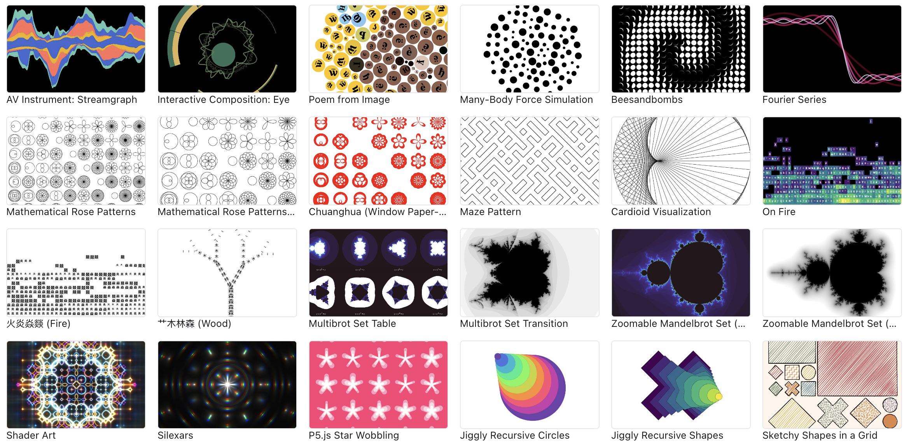

# Charming

**Charming**, short for _Charming Computing_, is a [free](https://github.com/charming-art/charming/blob/main/LICENSE), [open-source](https://github.com/charming-art/charming) data-driven language for creative coding and ASCII art with high performance. It has a declarative, concise, yet expressive API inspired by [G2.js](https://github.com/antvis/G2), [D3.js](https://github.com/d3) and [P5.js](https://p5js.org/).

> _Think of Charming as Lodash for graphics, or D3 for computational art._

